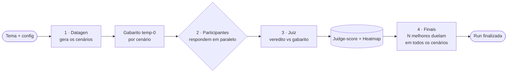
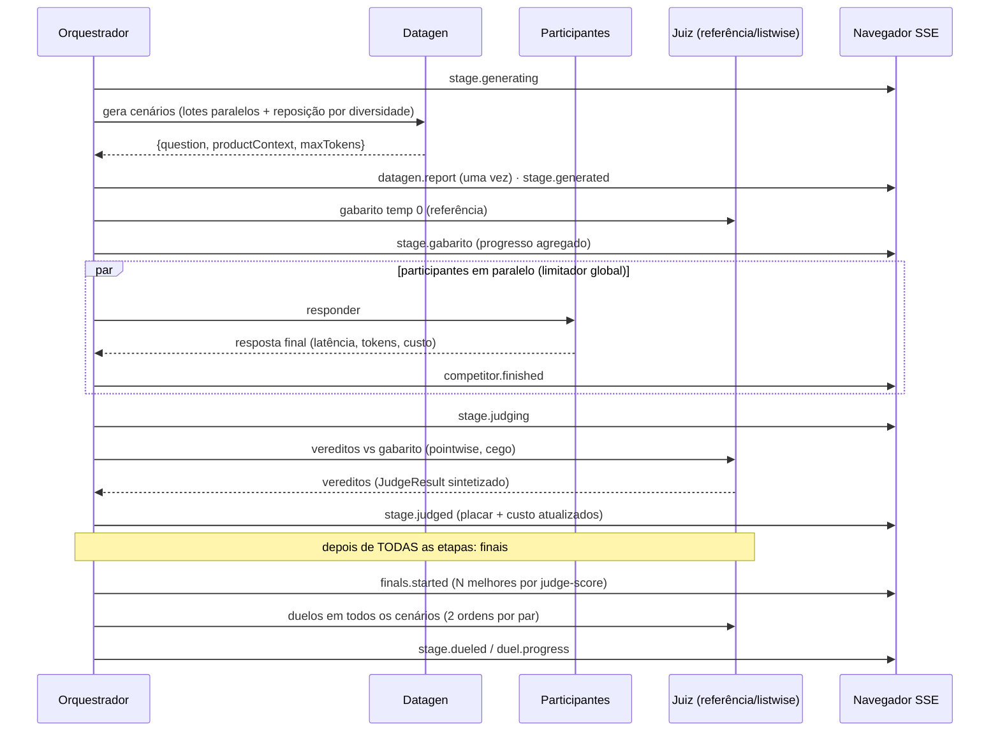

# Prompt Builder

Arena de benchmark **paralelo** de LLMs sobre a [OpenRouter](https://openrouter.ai), com três
superfícies para o mesmo motor: **interface web**, **CLI** e **servidor MCP**. Em três modos:
**comparar** vários modelos no mesmo desafio, **testar** vários prompts em um modelo, ou **treinar**
um prompt que evolui sozinho. Você dá um **tema**; um modelo **gera cenários**, os **participantes**
respondem ao mesmo tempo, um **juiz** compara cada resposta com um **gabarito** (resolve / parcial /
não) e os melhores **duelam** no fim. Durante a run a tela mostra, ao vivo (SSE), as fases, o
**heatmap de vereditos** e o **gasto face ao teto**; as respostas completas aparecem quando cada
etapa termina.

> **Em uma frase:** "dado um tema, descubra qual modelo (ou qual prompt) responde melhor — e quais
> respostas são boas o bastante para usar no trabalho de verdade — com evidência, ranking e custo."

> **Novo por aqui?** O **[GUIA](./GUIA.md)** leva do primeiro acesso (a chave do OpenRouter) à
> leitura do resultado — em linguagem de quem usa a interface, sem jargão do motor.

---

## Começo rápido

### Pela interface (humanos)

```bash
npm install && npm run setup   # raiz + web/ (o MOTION_TOKEN é opcional, ver "Como rodar")
npm run dev                    # API :3001 (tsx watch) + Vite :5173 (proxy de /v1 e /health)
```

Abra `http://localhost:5173`, cole a key do OpenRouter e siga a **Nova run guiada** (5 passos, com o
custo estimado antes de gastar). A mesma SPA roda **sem backend** — o motor roda na aba e guarda no
IndexedDB —, que é como ela é publicada estática (Vercel). As telas, passo a passo: [GUIA](./GUIA.md).

### Pelo terminal (CLI publicado no npm)

```bash
# a ferramenta ensina o agente a usá-la (docs embarcadas, casadas com a versão)
npx prompt-builder-cli docs quickstart

# descobre o modelo do ambiente e QUAIS níveis de raciocínio ele aceita
npx prompt-builder-cli models show anthropic/claude-opus-5 --json

# um arena-config@1 de exemplo, e o pré-voo inteiro SEM gastar (e sem key)
npx prompt-builder-cli config example --mode train -o arena.json
npx prompt-builder-cli train --config arena.json --budget 10 --dry-run --json

# treina com teto de gasto, emitindo um evento JSON por linha
npx prompt-builder-cli train --config arena.json --budget 10 --output-format ndjson

# quanto o prompt melhorou e quanto a mudança muda o custo por chamada
npx prompt-builder-cli sessions report <sessionId> --html relatorio.html
```

Sem TTY, `--budget` é obrigatório (exit `2`, nada gasto). Se o pré-voo recusar por orçamento
(`usage.budget_below_estimate`), `error.details.estimate.high` diz o teto que passa. A key vai por
`OPENROUTER_API_KEY` ou `prompt-builder key set --stdin` — nunca como argumento.

### Para agentes de código (Claude Code, Codex, Cursor, …)

No checkout do repositório, **um comando** deixa esta cópia pronta para os agentes da máquina:

```bash
npm install && npm run agent-setup   # idempotente; nunca usa sudo nem `npm -g`
npm run agent-setup:doctor           # confere tudo (exit 1 se falta algo)
npm run agent-setup:uninstall        # remove só o que ele criou
```

O `agent-setup` (`scripts/agent-setup.sh`) faz quatro coisas, sem sobrescrever o que não escreveu:

1. **build** — compila `dist/` quando falta ou está mais velho que `src/`;
2. **bins** — escreve os lançadores `prompt-builder`, `pbuilder` e `prompt-builder-cli` em
   `.local/bin` do seu home (ou em `PB_BIN_DIR`), que executam **este** `dist/`. Sem eles o agente
   cai no `npx prompt-builder-cli`, que baixa a versão **publicada** — outra versão, outros comandos;
3. **skill** — liga `skills/prompt-builder` por **symlink** em todo diretório de skills de agente que
   existir: Claude Code (`.claude/skills`, os perfis `.claude-<nome>/skills` e
   `$CLAUDE_CONFIG_DIR/skills`), Codex, Copilot CLI, Cursor, Kiro, DSH, jcode, pi, Gemini CLI,
   OpenCode e `.agents/skills` (genérico);
4. **relatório** — garante o binário do **Plannotator** (instalador oficial em modo `--minimal`: só o
   binário) e as skills **`plannotator-visual-explainer`** (quem compõe o relatório de ciclos) e
   **`visual-explainer`** (de quem ela depende), ligadas nos mesmos diretórios. Uma cópia que já
   exista na máquina é reusada.

Opções: `--no-build`, `--no-bin`, `--no-plannotator`, `--target <dir>` (repetível); o resto em
`bash scripts/agent-setup.sh help`. Outros caminhos:

- **só a skill**, global por symlink: `bash scripts/install-agent-skill.sh install|doctor|uninstall`
  (a fonte única da descoberta de diretórios; também roda do pacote instalado, em
  `node_modules/prompt-builder-cli/scripts/`);
- **por projeto** (cópia versionada com o repo): `npx prompt-builder-cli init --agent all`;
- **sem instalar nada**: `npx prompt-builder-cli docs --list`, `docs <tópico>` e `skill`.

A skill ([`skills/prompt-builder/SKILL.md`](./skills/prompt-builder/SKILL.md)) ensina o agente a
operar o benchmark **sem interface web** — orçamento, `--dry-run`, NDJSON, MCP, modo agente, JEV,
`sessions report`, exit codes — apontando para as docs embarcadas em vez de as duplicar.

**Servidor MCP** no mesmo binário:

```bash
claude mcp add --transport stdio arena -- npx -y prompt-builder-cli mcp
```

Runs levam minutos e os clientes MCP cortam uma chamada em ~60 s, então o caminho é por **job**:
`start_run` devolve o `jobId` na hora (a run roda em segundo plano, uma por processo, as demais em
fila), `run_status` acompanha, `cancel_run` interrompe e `get_result` lê o desfecho;
`get_session_report` traz o relatório de ciclos, `estimate_cost`/`list_models` funcionam sem key e
`read_docs` lê as docs embarcadas. `idempotencyKey` é obrigatória no `start_run`: um retry com a
MESMA chave — até de outro processo — devolve o mesmo job em vez de pagar uma segunda run.
`run_benchmark`/`train_prompt`/`run_agent_benchmark` continuam, mas esperam no máximo ~25 s e então
devolvem o `jobId`. Cliente que declara a extensão `io.modelcontextprotocol/tasks` recebe uma task
(`tasks/get`, `tasks/cancel`). Cancelar (`cancel_run`, `tasks/cancel` ou `notifications/cancelled`)
interrompe na hora: nenhuma chamada paga nova sai e o parcial fica gravado como `aborted`
(`stoppedReason: "cancelled"`). Fechar o stdin ou mandar `SIGTERM` faz o mesmo com até ~10 s de
graça; um job que passa do prazo (`ttlSeconds`, padrão 2 h) também.

---

## O que ele faz

- **Três modos** — `compare` (qual modelo), `vary` (qual versão do prompt, num modelo) e `train` (o
  prompt evolui por iterações). No treino a promoção exige margem `minGain` **e** o teste da melhor
  de K **e** uma re-avaliação limpa; um **holdout** reservado (30% por padrão, piso de 10 cenários)
  e um teste pareado exato fecham a sessão.
- **Julgamento por referência** — gabarito temp-0 por cenário, juiz pointwise (resolve / parcial /
  não), painel por maioria simples e finais com duelos nas duas ordens. O juiz listwise é o fallback
  do compare clássico. **Modo econômico** (`--judge-cascade barato1,barato2:forte`): dois juízes
  baratos votam e o forte só julga os vereditos em dúvida.
- **Juiz JEV por default** — o **modelo de decisão** (Jev, da TypeSafe) julga cada resposta com uma
  pergunta tipada (`choice` resolve/parcial/não) mais uma pergunta por critério da rubrica, com
  probabilidades calibradas e motivo determinístico; o que ficar fora da banda `auto` **escala para
  os juízes LLM** (cascata), e indisponibilidade (ex.: área LGPD sensível, onde o Jev não é ZDR)
  cai no painel automaticamente. `--judge-engine llm` volta ao painel clássico;
  `--jev-judge-model` troca o modelo de decisão (`docs config`, seção `judging`).
- **Relatório de ciclos do treino** — quanto o prompt melhorou (original × campeão, por ciclo e no
  holdout) e quanto a mudança muda o custo **por chamada**. Está no CLI (`sessions report`), no MCP
  (`get_session_report`), na API (`GET /v1/benchmark/sessions/:id/report`) e na tela
  `/training/:id/report`; a versão rica sai pela skill `plannotator-visual-explainer`, entregue com
  `plannotator annotate`.
- **Modo JEV (decisões tipadas)** — mede e evolui definições de decisão `noul` / `choice` / `score`
  do Jev e de outros modelos de decisão em casos rotulados: calibração, bandas de confiança, custo
  por decisão e cascata com LLM. `prompt-builder jev …` no terminal; seletor **LLM | JEV** na Nova
  run.
- **Modo agente** — agentes de código (executor `pi`, sala limpa, container opcional) resolvendo
  tarefas verificadas por oráculo: `agents doctor` / `agents run` (`docs agents`).
- **Custo medido e orçamento honesto** — o gasto sai de `usage.cost` (o valor cobrado), por papel.
  As portas de orçamento param a run numa fronteira de fase e entregam o parcial honesto (exit `7`),
  nunca uma run "concluída" com vereditos inventados. O `--dry-run` recusa com o MESMO código da run
  real; há teto diário por máquina. BYOK só conta com `usage.is_byok` — sem ele o
  `upstream_inference_cost` já está dentro do `usage.cost` e somá-lo dobraria o gasto.
- **Dataset estável** — `library` (cenários + gabaritos por perfil, rótulos `expected` sem juiz,
  seeds adversariais, curadoria, troca `exchange@1`), contratos never-break, multi-prompt, pool
  Pareto e reflexão GEPA.
- **Confiança no juiz** — `calib report` (juiz × humano: α ordinal de Krippendorff, AC2 de Gwet,
  IC95% e portão exit `10`), `baseline pin|check` (juiz e gabarito só mudam com re-baseline
  declarada), `prompts regression` (suíte fixa dos meta-prompts internos) e `runs reproduce --replay`
  (re-pontua uma run gravada a US$ 0).
- **LGPD e dado pessoal** — allowlist por endpoint (fail-closed em área sensível, roteamento ZDR
  forçado) e pseudonimização PT-BR no gateway, ou o modo "só sintético".
- **Handoff do campeão** — `sessions winner --apply` (backup + diff; holdout regredido bloqueia com
  exit `10`), registro `prompt-approval@1` e trailers no commit; `registry validate` vigia o drift do
  prompt em código.
- **Ciclo de vida** — `models show` com os think levels que o modelo aceita, alertas de expiração
  30/14/7 dias, `runs export|import|delete|prune` e `sessions export|import|delete` (retenção:
  TTL de 90 dias, `PB_RETENTION_DAYS`).

Documentação completa para agentes: `npx prompt-builder-cli docs --list`.

---

Convenções para **agentes de código** que trabalham NESTE repositório estão em
[`AGENTS.md`](./AGENTS.md), nas skills de tarefa em [`.agents/skills/`](./.agents/skills/) e na
**memória CoALA** do projeto — veja [Skills e memória CoALA](#skills-e-memória-coala). (A antiga
documentação em `docs/`/`TELAS.md` foi consolidada na memória em 2026-09-26.)

---

## Sumário

- [Guia do utilizador (GUIA.md)](./GUIA.md)
- [Começo rápido](#começo-rápido) · [O que ele faz](#o-que-ele-faz)
- [Como funciona (visão geral)](#como-funciona-visão-geral)
- [Os três modos](#os-três-modos)
- [Relatório de ciclos do treino](#relatório-de-ciclos-do-treino)
- [Modo JEV (decisões tipadas)](#modo-jev-decisões-tipadas)
- [Os papéis dos modelos](#os-papéis-dos-modelos)
- [Conformidade LGPD (allowlist por endpoint)](#conformidade-lgpd-allowlist-por-endpoint)
- [Anatomia de uma etapa](#anatomia-de-uma-etapa)
- [Sistema de pontuação](#sistema-de-pontuação)
- [Stack tecnológica](#stack-tecnológica)
- [Estrutura do projeto](#estrutura-do-projeto)
- [Skills e memória CoALA](#skills-e-memória-coala)
- [Configuração](#configuração)
- [Como rodar](#como-rodar)
- [Fluxo de eventos (SSE)](#fluxo-de-eventos-sse)
- [Referência da API](#referência-da-api)
- [Persistência](#persistência)
- [Exportação CSV](#exportação-csv)
- [Resiliência ("overkill")](#resiliência-overkill)
- [Segurança da API key](#segurança-da-api-key)
- [Notas e limitações](#notas-e-limitações)

---

## Como funciona (visão geral)

O motor (o mesmo no CLI/servidor e, espelhado, no navegador) orquestra um **pipeline em etapas**.
Você define `N` etapas (cenários); cada etapa é um mini-benchmark independente e auto-contido, e as
**finais** acontecem depois que todas foram julgadas:



1. **Datagen** — um modelo recebe o tema (e um `scenarioBrief` opcional) e produz os **cenários**
   em lotes paralelos: uma pergunta de usuário (`question`), um **contexto de produto**
   (`productContext`: políticas, FAQs, dados, restrições — entregue ao participante como bloco de
   dado delimitado antes da pergunta; a variante sob teste é o único *system prompt*) e um teto de
   tokens sugerido (`maxTokens`). Cada etapa varia o tipo de tarefa (extração, raciocínio,
   comparação, recusa…). Um **pacote de cenários** importado vira seed e mescla com os gerados.
2. **Participantes** — respondem **ao mesmo cenário em paralelo** (a vazão é do limitador global
   do gateway). A resposta vai por *streaming* no fio, mas a UI não mostra o texto crescendo: cada
   resposta aparece inteira, com latência, tokens e custo, quando a etapa termina.
3. **Julgamento** — por default (fora do compare clássico) é **por referência**: um **gabarito**
   temp-0 é gerado por cenário, o juiz classifica cada resposta isoladamente contra ele
   (**resolve / parcial / não**, com explicação de 1 frase; com 2+ juízes vale a **maioria
   simples**, e painel dividido é **empate técnico**, nunca arredondado para cima). O **motor do
   juiz** é por default o **JEV** (modelo de decisão tipada, milissegundos por resposta): o veredito
   vem com probabilidades, e o que ficar na banda de baixa confiança escala para os juízes LLM
   (`--judge-engine llm` desliga e usa só o painel). Sem gabarito
   (ou no compare clássico), cai no **juiz listwise** clássico: ordena as respostas às cegas e dá o
   veredito de aceitabilidade ("dá para usar em produção sem causar erro/dano?"). Com
   `--judge-cascade` (modo econômico, só com juiz LLM), dois juízes baratos votam e o forte só julga os vereditos em
   dúvida (divergência, voto `parcial` ou resposta de comprimento extremo).
4. **Finais** — depois de todas as etapas julgadas, os **N melhores por judge-score médio**
   (`finalists`, padrão 3) duelam entre si em **todos** os cenários, cada par nas duas ordens
   (desacordo entre as ordens = empate); a classificação final é a **taxa de vitória**.

**Todas as etapas rodam em paralelo** (cenários pré-gerados juntos; execução concorrente limitada
por um semáforo global adaptativo). O placar é aditivo, então a ordem de término não importa; ao
final a run é `finished` (ou `inconclusive`, quando vereditos demais se perderam) e fica no
histórico, com export JSON/CSV.

Tudo é transmitido ao navegador em tempo real via **Server-Sent Events (SSE)**: durante a run a tela
da run mostra um **Resumo em linguagem natural** (fases do pipeline com contagem, placar simples e
gasto face ao teto) e o **heatmap** de vereditos por cenário × participante; os duelos finais e os
diagnósticos entram quando tudo termina. O caminho de alto nível está no [GUIA](./GUIA.md#6-durante-a-execução);
o motor, abaixo.

---

## Os três modos

A **Nova Run** tem duas superfícies sobre o mesmo estado: o **fluxo guiado** (default, 5 passos em
linguagem natural — Objetivo → Teste → Participantes → Limites → Revisão, com o plano da run em
frases) e a **configuração completa** (página única com tudo à vista) — ver [GUIA §3–4](./GUIA.md#3-a-configuração-guiada).
Qualquer uma delas atende três objetivos. O que muda é **quem é o "participante"** (`Contestant`):

| Modo | O que compara | Participante | Endpoint | Requisito |
|---|---|---|---|---|
| **Comparar modelos** (`compare`) | Vários **modelos**, mesmo desafio | cada modelo (id === modelId) | `POST /runs` | ≥ 2 `competitorModelIds` |
| **Testar prompts** (`variation`) | **Um modelo**, vários *system prompts* | mesmo modelId, `systemPrompt` distinto | `POST /runs` | 1 `contestantModelId` + ≥ 2 variações |
| **Treinar prompt** (`training`) | Um prompt que **evolui** por iteração | idem variation, encadeado | `POST /sessions` | + `iterations` (2–10) |

- **Variação** gera as versões do prompt de dois jeitos: **otimização ligada** → um modelo
  *optimizer* reescreve o `basePrompt` aplicando **técnicas** selecionadas (`techniqueIds`, biblioteca
  curada em `src/techniques.ts`); **desligada** → você escreve as variações manualmente
  (`manualVariants`). Um `basePrompt` opcional roda como **controle**.
- **Treino** repete a variação por `N` iterações (`src/trainer.ts`): a melhor versão de cada rodada
  é a semente da próxima — mas **só é promovida** se superar a régua por `minGain` (padrão
  `max(1; 50/n)` p.p.) **e** passar no teste da melhor de K (max-T por permutação, p ajustado ≤
  0,05) **e** na re-avaliação limpa; com paciência 2 (duas iterações seguidas sem promoção) ou
  platô, a sessão **converge** e para. Os cenários são **congelados** após a iteração 0
  (`pinnedStages`); uma fatia de **holdout** (`holdoutRatio`, padrão **0,3**, piso absoluto de **10
  cenários** — com menos de 20 cenários não há holdout, é "confirmação fraca") fica fora da
  seleção. O feedback vem de **lições determinísticas** das falhas do campeão (sem LLM extra; a
  reflexão por LLM é opt-in). Ao final, o campeão enfrenta a base no holdout com um **teste pareado
  exato** (troca de sinais + IC por inversão). O treino default tem **10 cenários** (com menos, o
  gate quase não consegue promover). Acompanhe em `TrainingView` e leia o
  [relatório de ciclos](#relatório-de-ciclos-do-treino).
- Nos modos de um modelo, o **juiz nunca é o modelo sob teste** (anti-viés de auto-preferência), e
  há a opção **"juiz em 2 ordens"** (`judgePasses: 2`) contra viés de posição.

`RunConfig` é uma **união discriminada por `mode`** (`src/types.ts`), validada pelo Zod de
`src/runConfigSchema.ts` (o mesmo no servidor, no CLI e no MCP). O arquivo de configuração
portátil é o `arena-config@1` — contrato campo a campo em `prompt-builder docs config`.

---

## Relatório de ciclos do treino

Responde, com números **medidos**, às duas perguntas de quem decide: *quanto o prompt melhorou*
(judge-score original × campeão, por ciclo e no holdout, com Δ, IC95 e p) e *quanto a mudança muda
o custo de usar o prompt* (custo, tokens e latência **por chamada**, pareados pela mesma pergunta;
projeção mensal com `--calls-per-month`). Também traz o custo da otimização por papel, o diff do
prompt e as ressalvas (holdout pulado, regressão, drift de juiz, custo desconhecido).

| Onde | Como |
|---|---|
| CLI | `prompt-builder sessions report <id>` (Markdown) · `--json` · `--html <arq>` · `--markdown <arq>` · `--annotate` |
| MCP | `get_session_report` (`format`: `markdown` \| `json` \| `html`) |
| API | `GET /v1/benchmark/sessions/:id/report?format=json\|html\|markdown&callsPerMonth=N` |
| Web | botão **Relatório de ciclos** na tela do treino (`/training/:id/report`), com "Baixar HTML" |

O `--html` já sai no tema do Plannotator. Para uma versão explicada a quem vai decidir, o agente usa
o Markdown como *brief* da skill **`plannotator-visual-explainer`** e entrega com
`plannotator annotate <arquivo.html>` — o `npm run agent-setup` instala os dois. Detalhes e como ler
sem se enganar: `prompt-builder docs report`.

---

## Modo JEV (decisões tipadas)

Para classificação, roteamento, triagem, guardrail e scoring em alto volume, o modo **JEV** mede e
evolui **definições de decisão** (`noul` = sim/não, `choice` = 1 de N, `score` = régua ordenada) do
Jev (TypeSafe) e de outros modelos de decisão, em casos **rotulados**: acurácia, Brier, ECE,
bandas de confiança, custo e latência por decisão, comparação com um LLM e cascata (o Jev decide o
que cai na banda de confiança e escala o resto). Formato próprio `jev-config@1`.

- **Web:** o seletor **LLM | JEV** no topo da Nova run (`/new?tipo=jev` abre direto); o motor roda
  na aba e os records ficam no IndexedDB. Se a rede bloquear o endpoint, o mesmo JSON roda no
  terminal e volta por «Histórico → JEV → Importar do terminal».
- **CLI:** `prompt-builder jev validate|example|models|import|run|eval|compare|train|list|show|report|export|techniques`
  (alias `decisions`); `jev validate` e `--dry-run` não gastam.
- **MCP:** as tools existentes aceitam `jev-config@1` (`start_run`, `estimate_cost`, `get_result`, `list_models`).
- **O Jev também é o juiz default** dos três modos de benchmark: cada resposta vira uma decisão
  tipada (veredito + critérios da rubrica) e o que o Jev deixa em dúvida escala para os juízes LLM
  — ver "Juiz JEV por default" acima e `docs config` (seção `judging`).

O Jev não é ZDR: em área LGPD sensível o modo fica indisponível. Contrato completo:
`prompt-builder docs jev`.

---

## Os papéis dos modelos

Toda run tem **modelos de apoio** (gerador + juiz) além dos participantes:

| Papel | Quantos | O que faz | Configuração |
|---|---|---|---|
| **Participante** | compare: **≥2** (ou 2–12 configs); variation/training: **1** (+ variações) | Respondem ao cenário e disputam o ranking | `competitorModelIds[]` / `competitorConfigs[]` / `contestantModelId` |
| **Gerador (datagen)** | exatamente **1** | Inventa os cenários (pergunta + contexto + maxTokens) | `datagenModelId` |
| **Juiz** | **1 ou mais** (ou a cascata: 2 baratos + 1 forte) | Vereditos vs gabarito + duelos das finais (ou ranking listwise, no fallback) | `judgeModelIds[]` · `judgeCascade` (`--judge-cascade`) |
| **Referência (gabarito)** | 1 (**obrigatório** em variation/training; em compare o default = 1º juiz) | Gera a resposta de referência temp-0 por cenário | `referenceModelId` |
| **Optimizer** | 1 (variation/training) | Reescreve prompts aplicando técnicas | `optimizerModelId` (default = `datagenModelId`) |

**Regras validadas pelo schema** (Zod) — config inválida é recusada com `400` na API e exit `3` no CLI:

- compare: ≥ **2 competidores distintos**; nem gerador nem juiz são competidores (o gerador pode
  ser também um juiz — é o default do compare).
- variation/training: ≥ 2 variações (técnicas ou manuais, contando o `basePrompt` como controle);
  **juiz ≠ modelo sob teste**.
- **papéis separados (IMPL-048):** a referência **não pode ser juiz nem competidor** (erro de
  config — o mesmo modelo escreveria o gabarito e o veredito sobre ele, com erros correlacionados);
  o mesmo vendor/família só gera **aviso** de viés em `fairnessWarnings`. `referenceModelId` é
  **obrigatório em variation/training**; em compare o default documentado (1º juiz) é denunciado
  pelo mesmo aviso, nunca escondido.
- **esforço de raciocínio por papel (IMPL-079):** `reasoning.judge` / `reasoning.duel` /
  `reasoning.gab` **não compartilham mais um campo só**. Defaults: juiz pointwise **`medium`**,
  duelo **`low`** e gabarito **`high`** (acima de `low` o ganho de esforço satura ou reverte e o
  papel juiz domina o custo). Papel sem campo próprio cai no `reasoning.judge` antigo (compat) e,
  sem nenhum dos dois, no default do papel — sempre com `fitEffort` na allowlist do modelo. Exemplo
  de config (judge=medium, duel=low, gab=high):

  ```json
  "reasoning": { "competitor": "low", "judge": "medium", "duel": "low", "gab": "high" }
  ```

---

## Conformidade LGPD (allowlist por endpoint)

Na configuração **completa** da Nova run, em «Avançado», há o bloco **"Conformidade LGPD"** (no
guiado, o último passo leva até lá) que **filtra o catálogo de modelos** conforme a área de uso — útil porque este repositório é do **Grupo Fleury** (dados de
saúde = sensíveis). Você escolhe uma **área** (Geral, Jurídico, Saúde, Financeiro, Crianças e
adolescentes, Setor público — ou **"Livre"**, que mostra tudo) e um **rigor** (incluir ou não
modelos "permitido com ressalvas").

A unidade da política é o **endpoint** (provedor + região/variante), como no OpenRouter — não o
criador do modelo:

- **Áreas sensíveis** (todas menos Geral) são **fail-closed**: um modelo só passa com criador
  conhecido **e** ≥ 1 endpoint ZDR de provedor mapeado no snapshot. Desconhecido ⇒ bloqueado
  (criador fora da base, provedor fora do mapa, modelo que surgiu depois da geração, área
  inexistente). Snapshot com mais de **90 dias** (alvo 30) bloqueia a área inteira.
- A run/sessão sensível passa por um **pré-voo** antes de qualquer chamada de LLM: se QUALQUER
  papel que vê o dado (competidor, juiz/duelo, gerador, gabarito, reescritor) estiver fora da
  allowlist, ela é recusada com o papel e o motivo na mensagem.
- **Geral** segue consultiva (classificação por criador; China/SG → não recomendado).

- **Roteamento forçado (modo "dados sensíveis", fail-closed):** em área sensível, TODA requisição
  dos 6 papéis sai com `provider: { zdr: true, data_collection: "deny", only: [tags ZDR da
  allowlist do modelo], allow_fallbacks: false }` — sem fallback silencioso para endpoint que
  retém dados. Se faltar qualquer um dos 4 campos (modelo sem rota, snapshot ausente/vencido), a
  chamada é recusada **antes** do envio. Ponto único: o gateway (`src/engine/sensitiveRouting.ts`,
  aplicado em `OpenRouterGateway.buildBody`), igual no CLI/servidor e na SPA — inclusive o
  "Gerar prompt base" da tela Nova Run. **Modo agente não roda em área sensível:** o executor do
  agente (`pi`) chama o provedor por fora do gateway e não enviaria os 4 campos, então o pré-voo
  recusa a run (`roteamento_incompleto`) antes de qualquer LLM. As tags de cada modelo:
  `models allowlist --area saude`.

> ⚠️ **Não é aconselhamento jurídico.**

- Classificação: **um só** núcleo puro, [`src/engine/lgpdCore.ts`](./src/engine/lgpdCore.ts),
  usado pelo CLI/servidor (`src/lgpd.ts`), pela SPA (`web/src/lgpd.ts`) e pelo gerador.
- Base de conhecimento: [`src/data/lgpd-compliance.json`](./src/data/lgpd-compliance.json) (áreas
  com `sensivel`, famílias, origem de providers/criadores, status ANPD, config ZDR recomendada).
- Snapshot por endpoint (consumido em runtime, viaja no pacote npm):
  [`src/data/lgpd-allowlist.generated.json`](./src/data/lgpd-allowlist.generated.json).
- Regenerar: `npm run lgpd:allowlist` (endpoints **públicos** `/models` e `/endpoints/zdr` — sem
  key). A CI regenera toda semana e abre PR (`.github/workflows/lgpd-allowlist.yml`).
- Conferir idade e contagens: `prompt-builder models allowlist --check [--max-age 30] [--json]`
  (exit 3 se vencida/ausente ou com desconhecido liberado).
- Servido em `GET /v1/benchmark/lgpd`.

### Dado pessoal: redação obrigatória e modo "só sintético"

Toda chamada de LLM — dos 6 papéis (gerador, gabarito, competidor, juiz, duelo, reescritor), no
CLI, no servidor e na SPA — passa por uma **cascata PT-BR** no ponto único do gateway
([`src/engine/pii.ts`](./src/engine/pii.ts)) **antes** do envio:

1. **Identificadores estruturados** (regex + dígito verificador mod-11 onde existe): CPF, CNPJ
   (inclusive o **alfanumérico** de jul/2026), CNS, RG, CEP, telefone, e-mail e CRM saem
   **pseudonimizados** (`[CPF_1a2b3c4d5e6f]` — o mesmo documento em qualquer formatação vira o
   mesmo token). O token é **HMAC-SHA-256 com chave secreta de 256 bits por run/sessão**: conhecer
   pares valor→token (o CPF que o próprio modelo gerou volta pseudonimizado) não permite prever
   nem reverter outro token, e runs diferentes não se ligam pelo mesmo titular. Placeholders
   (`(11) 99999-9999`), exemplos notórios e números de serviço (0800/4004) não mexem.
2. **Nomes e endereços** (heurística local de dicionário + gatilhos — **não** um NER): detectados
   e contados, **não reescritos** — marcados **"não coberto"**: não há promessa de recall (a
   literatura mede ~49% para nomes em texto livre). Se os seus dados têm nomes reais, use o modo
   "só sintético".
3. **Aparência de dado real** ⇒ **bloqueio com aviso nomeando o campo**, nunca correção silenciosa:
   identificador forte realista (CPF, CNS, RG com rótulo de identidade, CRM, celular, e-mail pessoal) ou "ficha" de titular
   (nome + identificador forte, ou nome + ≥2 dados fracos como endereço + CEP). Nome de **persona**
   do prompt ("Você é a Ana Paula, atendente… Rua Augusta, 1500") e contato comercial viram só
   aviso. Vale na **importação** — JSON de cenários, pacote, `arena-config@1`, `arena-agent-config@1`
   e **RunConfig cru** (CLI `--config`/flags, `estimate`, `config validate`, MCP, `POST /runs` e
   `/sessions`), `library add` e `library seed --file` — e de novo no **pré-voo** da run (SPA inclusive).

**Modo "redigir"** (padrão): o bloqueio acima exige **revisão explícita** — `allowPii: true` no
config (CLI `--allow-pii`; SPA: "Revisei — importar/iniciar mesmo assim"). Revisado, os
identificadores seguem pseudonimizados no envio e **voltam ao valor original nas respostas**
(reversão fora do caminho de envio: o mapa token→valor vive só em memória, por run/sessão) — o
prompt campeão, o cenário e o gabarito nunca carregam token, e `neverBreak` com o valor original
continua valendo. Dado de empresa (CNPJ, fixo, CEP, e-mail funcional) nem pede revisão, mas sai
pseudonimizado do mesmo jeito e a tela da run diz isso. O record guarda em `piiReport` os campos achados
(caminho + tipos, **nunca o valor**); o CLI narra o mesmo no stderr. Nomes em texto livre seguem
como estão. **Modo "só sintético"** (`piiMode: "synthetic"`; `--pii-mode synthetic`; switch em
Avançado na Nova Run): a run/sessão é **recusada**, antes de qualquer LLM, sem exceção manual. O
**modo agente** (executor `pi`, que fala com o provedor por conta própria, fora do gateway) é
sempre tratado como "só sintético" — fail-closed para dado de aparência real. ⚠️ O que é só
**aviso** (CNPJ, fixo, CEP, e-mail funcional, nome) passa no pré-voo e, no **executor**, segue
**cru** para o provedor (nos demais papéis sai pseudonimizado); o CLI e a tela da run avisam. O
ground truth determinístico (`expected`) compara a resposta reidratada com o rótulo cru.

Medido na fixture própria [`test/fixtures/pii-ptbr.json`](./test/fixtures/pii-ptbr.json)
(353 casos): recall 0,98 e precisão 1,00 nos estruturados, 0% de falso positivo no bloqueio
(`test/lgpd-pii.test.ts`).

Detalhes para agentes na memória CoALA do projeto (`coala.py search "lgpd"`).

---

## Anatomia de uma etapa



Pontos-chave (`src/orchestrator.ts`):

- **Datagen em lotes:** cenários pré-gerados em paralelo (`generateStages`), com dedup ROUGE-L e
  backfill; falha de uma etapa **pula a etapa** — a run **nunca trava**.
- **Cego (blind):** antes do juiz, as respostas são **embaralhadas** e rotuladas
  `A, B, C…` — o juiz não sabe qual modelo é qual. A UI mostra "(era A)" depois (no fluxo listwise).
- **Referência com fallback:** etapa sem gabarito (ou compare clássico) cai no juiz **listwise**;
  o resultado do julgamento por referência é **sintetizado num `JudgeResult`** para placar e UI.

---

## Sistema de pontuação

Há **duas réguas, não intercambiáveis** (o CLI e a tela sempre dizem qual usaram), sobre uma
unidade comum — o **veredito**:

### 1. Veredito por cenário → judge-score e heatmap

Cada resposta recebe um **veredito** contra o gabarito (no listwise, do próprio juiz):

- ✅ **resolve** — resolve a necessidade de forma correta e segura, **mesmo não sendo a melhor**;
- ◐ **parcial** — serve em parte (falta algo ou desvia do contexto);
- ❌ **não** — erro factual, viola contexto/política, ou incompleta a ponto de não servir.

O **judge-score** é `(resolve + 0,5 × parcial) / julgados × 100`. Falha do juiz **não é
veredito**: fica ausente, fora da média (nunca vira `não`), e com perdas demais (> 10% num papel ou
< 5 cenários julgados) a run sai `inconclusive`. Respostas com **erro/vazias** são automaticamente
**não aceitáveis** (sem gastar chamada de LLM). O **heatmap** mostra o veredito de cada participante
em cada cenário.

### 2. Finais → taxa de vitória (`standings`)

Os **N melhores por judge-score médio** duelam em todos os cenários, cada par nas duas ordens; a
classificação é `(vitórias + 0,5 × empates) / duelos disputados`, com V–E–D ao lado. Empate nos
duelos desempata pelo judge-score, nunca pela ordem de cadastro. Sem finais (`--no-duels`,
`finalists: 0`, orçamento), a régua é o judge-score.

### Fallback listwise (compare clássico)

Sem gabarito, o juiz **ordena** as respostas às cegas (rótulos `A, B, C…`) e dá o veredito. O placar
é estilo "corrida": com **N** respostas válidas, 1º = **N−1** pontos, … último = **0**, somados em
todas as etapas (`applyScoreboard`); o heatmap mostra a posição.

> É a diferença entre "**quem ganhou**" (finais) e "**quem serve**" (aceitabilidade): um modelo
> pode quase nunca vencer e ainda assim ser aceitável em 100% das etapas.

---

## Stack tecnológica

**Motor, CLI e backend** (`src/`)

- **Node.js ≥ 20.11** (ESM, `"type": "module"`, `NodeNext` — imports relativos com extensão `.js`)
  + **Express 4** (só o servidor self-host).
- **TypeScript 5** (strict) — compilado para `dist/` (o CLI mora em `src/cli/` e compila junto).
- **Zod 4** — schema único da config de run (`src/runConfigSchema.ts`) e dos JSONs devolvidos pelas LLMs.
- **`fetch` nativo** — chamadas à OpenRouter (sem SDK), com streaming SSE; tudo passa por UM
  gateway (`src/openrouter.ts`) com limitador global adaptativo e contabilidade de custo por papel.
- **`EventEmitter` nativo** — barramento de eventos por run/sessão (`src/events.ts`).
- Sem banco de dados: **persistência em arquivos JSON** (`data/` no servidor, `~/.prompt-builder` no CLI).
- CLI e servidor MCP escritos à mão (`node:util` `parseArgs`, JSON-RPC), zero dependência extra.

**Frontend** (`web/`)

- **React 19** + **React Router 6** — SPA; **Vite 5** (dev server com proxy de `/v1` e `/health`) e build.
- **Tailwind v4 + shadcn + Motion UI**, só com classes semânticas; tokens em `web/src/index.css`,
  tema claro/escuro pela classe `dark`. Motion+ (`motion-plus`) é **opcional**: sem o
  `MOTION_TOKEN` o build usa os substitutos abertos de `web/src/motion-plus-fallback/`.
- **Motor no navegador** (`web/src/engine/`): o mesmo pipeline roda na aba; módulos puros são
  fonte única em `src/` (re-exportados por shim) e os pares com seam divergente são mirrors
  vigiados por `test/engine-sync.test.ts`.
- **IndexedDB** (`web/src/idb.ts`, db `prompt-builder` **v3**: runs, sessões, biblioteca de prompts
  e os records do modo JEV).

**Integração externa**

- **OpenRouter** — gateway único para todos os modelos. Catálogo + preços via `GET /models`
  (público); geração via `POST /chat/completions`; decisões do modo JEV via o endpoint de decisões;
  validação de key via `GET /key`. `/models` e `/endpoints/zdr` são **públicos**.

---

## Estrutura do projeto

```
prompt-builder/
├─ src/                      # Motor + CLI + servidor (TypeScript → dist/)
│  ├─ cli/                   # CLI `prompt-builder` (index.ts, commands/*, ndjson.ts, preflight.ts) + servidor MCP
│  ├─ server.ts / routes.ts  # Express: /health, /v1/benchmark/* (Zod, SSE, CSV, relatório), serve web/dist
│  ├─ agentRoutes.ts         # /v1/agents/* — só com PROMPT_BUILDER_AGENTS=1
│  ├─ orchestrator.ts        # Loop da run: datagen → gabarito → participantes → juiz → finais
│  ├─ trainer.ts             # Modo training: iterações, gate, holdout (sessão)
│  ├─ variator.ts / techniques.ts   # Variações de prompt (técnicas curadas / manuais)
│  ├─ datagen.ts / dedup.ts / embeddings.ts   # Cenários, dedup exato+semântico, relatório da geração
│  ├─ competitor.ts          # Roda 1 participante (retry, truncamento, custo)
│  ├─ gabarito.ts / refJudge.ts / judge.ts / duels.ts   # Gabarito, juiz pointwise (+ cascata), listwise, finais
│  ├─ rank.ts / holdout.ts / stats.ts   # Promoção (minGain + melhor de K), holdout, significância exata
│  ├─ openrouter.ts / budget.ts   # Gateway único (limitador, retries, BYOK) e ledger de custo por papel
│  ├─ roleLimits.ts          # Tetos de tokens e pisos de timeout POR PAPEL
│  ├─ metaPrompts.ts         # Fingerprint dos meta-prompts internos (`prompts regression`)
│  ├─ lgpd.ts / library.ts / registry.ts / storage.ts / types.ts
│  ├─ engine/                # Núcleos PUROS (fonte única p/ Node e navegador): lgpdCore, pii,
│  │                         #   sensitiveRouting, sessionReport(+Html), trainingPolicy, bestOfK,
│  │                         #   calibration, roleSeparation, verdictCache, jev/ (motor JEV), …
│  ├─ jev/                   # Persistência Node + job/MCP do modo JEV
│  ├─ agent/                 # Modo agente: executor pi, sala limpa, container, oráculo, dossiê
│  └─ data/                  # JSON estático VERSIONADO (lgpd-compliance, lgpd-allowlist.generated)
│
├─ web/                      # SPA (React + Vite)
│  └─ src/
│     ├─ main.tsx            # Rotas: /new, /runs, /runs/:id, /training/:id(/report), /jev/…, /prompts, /settings
│     ├─ api.ts / backend.ts # Fachada do motor na aba + leitura do backend self-host (somente leitura)
│     ├─ engine/             # Motor no navegador (shims + mirrors do src/)
│     ├─ jev/                # Modo JEV na aba (store IndexedDB v3, import do terminal)
│     ├─ idb.ts / index.css  # IndexedDB v3 · tokens de tema
│     ├─ components/         # AppShell, GuidedSetup, ModelSelector, KeySetup, RunNarrative, … (+ ui/ e motion-ui/ do CLI)
│     └─ pages/              # NewBenchmark (LLM | JEV) → NewRun, RunsList, RunView, TrainingView,
│                            #   TrainingReport, PromptsPage, Settings, jev/*
│
├─ agent-docs/               # Docs embarcadas no pacote (`prompt-builder docs <tópico>`)
├─ skills/prompt-builder/    # Skill de agente (SKILL.md + models.md) — fonte única, vai no tarball
├─ scripts/                  # agent-setup.sh, install-agent-skill.sh, docs-lint.ts, check-model-ids.ts,
│                            #   gen-lgpd-allowlist.mjs, tarball-gate/smoke, release-tag, stats-sim
├─ test/                     # Testes de contrato (vitest) — `npm test`
├─ .agents/skills/           # Skills de TAREFA do repo + memória CoALA (ver abaixo)
├─ .claude/skills            # symlink → ../.agents/skills (portabilidade Claude Code)
├─ AGENTS.md                 # Instruções para agentes de código (CLAUDE.md é symlink)
├─ data/                     # runtime do servidor: runs/ e sessions/ (gitignored — regra /data/)
├─ .env.example              # Variáveis OPCIONAIS (o app roda sem .env)
├─ README.md  ·  GUIA.md     # Este arquivo · guia do utilizador (telas e fluxos)
└─ package.json  ·  tsconfig.json  ·  vitest.config.ts  ·  vercel.json
```

---

## Skills e memória CoALA

O conhecimento do projeto vive na **memória CoALA local**
([`.agents/prompt-builder-coala-memory-agent-skill/`](./.agents/prompt-builder-coala-memory-agent-skill/)):
uma base SQLite com busca híbrida (FTS5 + vetor, fusão RRF), memória **episódica, semântica e
procedimental**, working memory orçamentada, proveniência (`owner`/`agent`/`untrusted`) e supersessão.
As antigas *knowledge skills* (`knowledge-*`), o `project-router` e as meta-skills foram
**destiladas para essa memória** (chaves `skill:<nome>:<tema>`) e apagadas em 2026-09-27; o
conteúdo das 32 deep researches técnicas e dos documentos do projeto também está lá (chaves
`R-xx:DEC-n`, `R-xx:REC-n`, `docs:Q-xx`, `docs:pivo-P-x`, …).

**Como usar (agentes de código):** no início de cada tarefa,
`python3 .agents/prompt-builder-coala-memory-agent-skill/scripts/coala.py recall "<tarefa>" --budget 1500`;
para dúvidas pontuais, `coala.py search "<termos>"`; no fim, registar o durável com `coala.py add`
(a supersessão por `--key` faz o papel do antigo GC de skills).

```
.agents/skills/                              (fonte única; .claude/skills é symlink)
├─ prompt-builder-coala-memory-agent-skill/  memória CoALA local (conhecimento do projeto)
├─ task-*/                                   memória procedural (terminam com o registo de
│                                            aprendizado + LEARNINGS.md):
│                                            add-endpoint, edit-newrun-form, run-and-verify
└─ catalog.md                                índice · skill-template.md  modelo
```

**Memória evolutiva com salvaguardas:** skills de tarefa terminam com um passo que destila
aprendizados em `LEARNINGS.md` e na memória. Inspirado em Voyager (persistir só após verificação) e
Reflexion (feedback verbal). **Gate humano inegociável:** toda atualização de skill (ou registro
durável na memória) é um *commit* separado para revisão pelo diff — pesquisa da ETH Zurich
(arXiv:2602.11988) mostra que contexto auto-gerado *sem curadoria* piora o desempenho do agente.
As skills aqui são **rascunhos curados**: trate-as como tal e revise antes de confiar.

**Portabilidade:** fonte única em `.agents/skills/`, frontmatter mínimo (`name` + `description`),
symlinks versionados. Começo: [`AGENTS.md`](./AGENTS.md) (comandos exatos + regras não-óbvias),
[`catalog.md`](./.agents/skills/catalog.md) e a memória CoALA. (A skill **do produto**, para quem
USA o benchmark, é outra: `skills/prompt-builder`, instalada pelo `npm run agent-setup`.)

---

## Configuração

**Não é preciso nenhum `.env` para rodar** — todos os parâmetros têm default. A **chave do
OpenRouter não vai em variável de ambiente** na interface: a app **pede-a logo ao abrir** (first-run,
com os pontos de risco/limite/revogação) e ela continua gerível em **Configurações** — fica na memória
da aba (ou no `localStorage`, com «Lembrar neste dispositivo») e sai do navegador só para o
OpenRouter. Detalhes no [GUIA §2](./GUIA.md#2-primeiro-acesso-a-chave). No CLI, a key vem de
`--key`, `OPENROUTER_API_KEY` ou do arquivo gravado por `key set --stdin` (modo 0600).

Variáveis **opcionais** do servidor/gateway (veja `.env.example`):

| Variável | Default | Para quê |
|---|---|---|
| `OPENROUTER_BASE_URL` | `https://openrouter.ai/api/v1` | Apontar para um proxy/gateway compatível |
| `OPENROUTER_APP_URL` | `http://localhost:3000` | Header `HTTP-Referer` de atribuição |
| `OPENROUTER_APP_TITLE` | `Prompt Builder` | Header `X-Title` de atribuição |
| `PROMPT_BUILDER_NO_ATTRIBUTION=on` | — | Não envia nenhum dos dois headers de atribuição (na SPA: Configurações › Privacidade) |
| `BENCHMARK_PORT` | `3001` | Porta do backend |
| `PB_HOST` (ou `--host`) | `127.0.0.1` | Interface de bind do backend. Fora de localhost é pedido explícito (aviso no log); com `PROMPT_BUILDER_AGENTS=1` o servidor **recusa** subir fora de localhost. `HOST` **não** vale para o bind (containers/CI exportam o hostname nele): se estiver definido fora de localhost, só gera um aviso — e, no modo agente, a recusa |
| `PB_ALLOWED_HOSTS` | — | Nomes extras aceitos no header `Host`/`Origin`, separados por vírgula (ex.: túnel ou proxy). Sem isso, só `localhost`/`127.0.0.1`/`::1` — o resto leva 400/403 (proteção contra DNS rebinding) |
| `PROMPT_BUILDER_AGENTS=1` | desligado | Monta `/v1/agents/*` (modo agente pela API); ausente, a rota não existe (404) |
| `OPENROUTER_MAX_CONCURRENCY` | `32` | Teto do limitador global adaptativo de chamadas ao OpenRouter |
| `OPENROUTER_STREAM_TRANSPORT=0` | streaming ligado | Papéis de avaliação em JSON em vez de streaming (proxy que não faz SSE) |
| `OPENROUTER_ROLE_TIMEOUTS` | por papel | Encurta o teto do gateway por papel: `judge=60/120,competitor=90/600` (inatividade/total, em segundos) |
| `OPENROUTER_AUDITABLE=on` | desligado | Juiz, duelo e gabarito com provedor travado (sem fallback) em toda run |

No CLI também valem `PROMPT_BUILDER_HOME` (data-dir; padrão `~/.prompt-builder`),
`PB_RETENTION_DAYS` (TTL dos records, padrão 90; `0` desliga) e `PROMPT_BUILDER_TELEMETRY=on`
(telemetria opt-in; desligada por padrão). O `npm run agent-setup` lê `PB_BIN_DIR` (destino dos
lançadores) e `PB_EXTRA_AGENT_DIRS` (diretórios de skills extras, separados por `:`).

Parâmetros da **run** (na tela de Nova Run, validados pelo schema):

| Campo | Faixa | Default |
|---|---|---|
| `stages` (cenários) | 1–50 | 5 (treino: **10** — com menos o gate quase não consegue promover) |
| `iterations` (treino) | 2–10 | 3 |
| `holdoutRatio` (treino) | 0–0,5 | **0,3** (piso absoluto de 10 cenários reservados; `0` desliga) |
| `concurrency` | 1–32 | 8 (só registrado — ver abaixo) |
| `timeoutMs` | 1.000–300.000 | 60.000 |
| `maxOutputTokens` | 50–16.000 | 500 |

`maxOutputTokens` é um **teto absoluto**; o efetivo é `min(maxOutputTokens, maxTokens do datagen)`.
`timeoutMs` vale para o competidor; os papéis de avaliação têm **piso próprio** (juiz 120 s, duelo
90 s, gabarito/datagen/reescritor 180 s; menos com raciocínio desligado) — o efetivo é
`max(timeoutMs, piso do papel)`, e o `--dry-run` mostra os valores em `roleTimeoutsMs`.

> A concorrência efetiva das chamadas ao OpenRouter é governada por um **limitador global
> adaptativo** (`OPENROUTER_MAX_CONCURRENCY`); o campo `concurrency` por run é legado (não limita
> mais o paralelismo). O funcionamento interno do motor está descrito nesta secção e no GUIA.

---

## Como rodar

`npm install && npm run setup` instala a raiz **e** o `web/` (o `postinstall` saiu de propósito:
publicado, ele quebraria o `npm i prompt-builder-cli` de quem instala o pacote — ver AGENTS.md).
O **`MOTION_TOKEN`** (registry privado do Motion+) é **opcional**: `motion-plus` é
`optionalDependency`, então sem o token o install pula o pacote privado e o Vite liga os
substitutos abertos de `web/src/motion-plus-fallback/`; com o token (time, CI, Vercel) vem o pacote
real. Token em <https://motion.dev/dashboard/tokens> (exige Motion+).

### Desenvolvimento

```bash
npm install && npm run setup
npm run dev      # backend :3001 (tsx watch) + Vite :5173 (proxy de /v1 e /health)
npm run cli -- models show openai/gpt-5-mini   # o CLI a partir do fonte (tsx)
```

Abra **`http://localhost:5173`** e cole sua chave OpenRouter na tela de setup.

### Produção (self-host)

```bash
npm install && npm run setup
npm run build:all   # backend (dist/) + front (web/dist/)
npm run start       # serve API + frontend juntos em http://localhost:3001
```

(`npm run build` sozinho compila só o backend/CLI para `dist/` — é o que o pacote npm e o
`npm test` usam.)

Em produção o Express serve `web/dist` e faz *fallback* de SPA só para **navegação** (rotas que
não comecem com `/v1` ou `/health`, sem extensão e fora de `/assets/`: asset ausente é 404, nunca
o `index.html`). O SPA leva os **mesmos headers de segurança do deploy da Vercel** (CSP com
`frame-ancestors 'none'`, `X-Frame-Options`, `nosniff`, `Referrer-Policy`, COOP), lidos do
`vercel.json`; `/v1` e `/health` levam a mesma lista com a CSP reduzida a `frame-ancestors 'none'`
(a do SPA bloquearia o estilo inline de um documento servido pela API).

**O que a UI servida pelo backend enxerga:** o SPA detecta o backend (`GET /health` da mesma origem
respondendo o JSON do serviço) e passa a **ler** as runs/sessões do servidor — as criadas pela API
HTTP (`curl`, agentes) aparecem no histórico e abrem na tela de run/treino, acompanhadas pelo SSE
de `/v1/benchmark/.../events`. É **somente leitura**: runs criadas **na UI** continuam rodando na
aba (IndexedDB), e a key do OpenRouter não vai para o servidor. Na SPA estática (Vercel) `/health`
é o `index.html` e esse modo fica desligado.

### Deploy estático (Vercel) — modo client-side

Há também um **modo 100% client-side**: o pipeline foi portado para **`web/src/engine/`**, então o
navegador chama o OpenRouter **direto** (CORS liberado), orquestra os runs na própria aba e persiste
no **IndexedDB** — sem backend stateful. Isso permite hospedar a SPA **estática** (ex.: Vercel) via
[`vercel.json`](./vercel.json) (build `npm run web:build`, output `web/dist`, SPA rewrite). Por que
isso importa: serverless é efêmero/stateless, então um servidor de run de minutos não roda lá; no
client-side a aba é o "processo vivo".

> ⚠️ **Não publique o backend `src/` na Vercel.** Ele persiste runs no filesystem (`data/runs/*.json`
> via `storage.ts`), que no serverless é efêmero/read-only e não-compartilhado entre invocações: o
> deploy *parece* ok (serve a SPA e responde `/health`), mas `GET /v1/benchmark/runs/:id` devolve
> `Run nao encontrada`. **Sintoma de deploy errado:** `/health` responde JSON
> (`{"status":"ok",…}`) em vez do `index.html` da SPA — é um deploy antigo do backend preso em
> produção; force um novo deploy estático.

**Trade-offs:** a aba precisa ficar aberta durante a run, e o
histórico é por navegador/dispositivo. O backend `src/` continua disponível como alternativa (host de
processo persistente: Railway/Render/Fly), mas **não é usado** pela SPA estática.

### Scripts (`package.json`)

| Script | O que faz |
|---|---|
| `npm run dev` | Backend (watch) + Vite, em paralelo (`concurrently`) |
| `npm run build` | `tsc` do backend/CLI → `dist/` (o que o pacote npm publica) |
| `npm run build:all` | `build` + `web:build` (backend e front) |
| `npm run start` | Roda o backend compilado (`dist/server.js`), servindo `web/dist` |
| `npm run cli -- <comando>` | O CLI a partir do fonte (tsx) |
| `npm run setup` | Instala o `web/` (`npm --prefix web install`) |
| `npm run agent-setup` · `:doctor` · `:uninstall` | Prepara a máquina para agentes (bins, skill, Plannotator) — ver [Começo rápido](#começo-rápido) |
| `npm run web:dev` / `web:build` / `web:install` | Atalhos para `web/` |
| `npm test` | **Testes de contrato** (vitest; o `pretest` compila `dist/` antes) |
| `npm run test:full` | A suíte inteira, incluindo docker/Monte Carlo (`PB_FULL=1`) |
| `npm run lgpd:allowlist` | Regenera a allowlist LGPD por endpoint (endpoints públicos, sem key) |
| `npm run gate:tarball` / `gate:smoke` / `gate:publint` / `gate:attw` | Portões do pacote antes de publicar (`prepublishOnly` roda todos) |

> Verificação = `npm test` + type-check (`npx tsc -p tsconfig.json --noEmit` e `cd web && npx tsc -b`)
> + execução manual. Os testes de contrato **travam o comportamento determinístico** (seeds,
> desempates, pisos), os whitelists silenciosos (`variationConfigFrom`, `normalizeRunRecord`), a
> sincronia do motor (`src/` × `web/src/engine/`) e a própria documentação: `test/docs-lint.test.ts`
> roda os exemplos de config e os comandos das docs embarcadas no validador real, e
> `test/docs-run-examples.test.ts` passa cada exemplo de `compare`/`vary`/`train` das docs (e deste
> README) pelo pré-voo com o orçamento escrito — rode-os antes e depois de qualquer refactor do
> pipeline. (As cópias de worktree em `.claude/` ficam fora do vitest.)

---

## Fluxo de eventos (SSE)

O backend mantém um **barramento de eventos por run** (`src/events.ts`). Ao abrir
`GET /v1/benchmark/runs/:id/events`, o cliente recebe um `snapshot` e depois o *stream* incremental
(os tipos são a união `RunEvent` de `src/types.ts`; consumidor deve **ignorar** tipo desconhecido).

| Evento | Quando | Carrega |
|---|---|---|
| `snapshot` | Ao conectar | Record completo |
| `run.started` | Início | Record inicial |
| `variants.generating` / `variants.generated` | Geração das variantes do prompt (variation/training) | — / `contestants` |
| `datagen.report` | Uma vez, logo após gerar os cenários (sem `stageIndex`) | `report` (pedidos/gerados/descartes/entregues, `warning` se faltou cenário) |
| `stage.generating` / `stage.generated` | Datagen | `stageIndex` / `spec` (+ `warning` se o gabarito truncou e foi descartado) |
| `stage.failed` | Datagen falhou (etapa pulada) | `stageIndex`, `error` |
| `stage.gabarito` | Progresso agregado dos gabaritos (`stageIndex: -1`) | `done`, `total` |
| `competitor.finished` | Participante terminou | `stageIndex`, `response` |
| `stage.incomplete` | Etapa fora do placar e das médias (hoje: truncamento) | `stageIndex`, `reason`, `detail`, `contestantIds` |
| `judge.truncated` | Veredito invalidado por saída do juiz cortada (fica ausente; duelo sem resultado) | `stageIndex`, `phase`, `contestantIds`, `kinds`, `detail` |
| `judge.contract.changed` | O contrato do juiz mudou desde o último pin visto (recalibre antes de comparar) | `previousHash`, `currentHash`, `detail` |
| `stage.judging` / `stage.judged` | Juiz | `stageIndex` / `judge`, `scoreboard`, `totalCostUsd` |
| `finals.started` | Início das finais (`pickFinalists`) | `finalists` (id, label, score) |
| `stage.dueled` | Duelos de um cenário nas finais | `stageIndex`, `duels` |
| `duel.progress` | Progresso agregado dos duelos (sem `stageIndex`) | `done`, `total` |
| `run.spend` | Gasto medido (`usage.cost`), acumulado e throttled | `spentUsd`, `budgetUsd`, `byRole` |
| `run.budget` | Uma porta de orçamento decidiu numa fronteira de fase | `phase`, `projectedUsd`, `remainingUsd`, `decision` (`go`\|`stop`) |
| `agent.started` / `agent.turn` / `agent.tool` / `agent.finished` / `agent.verified` | Modo agente (nunca a saída da ferramenta) | ids da execução + `turn`/`toolName`/`stopReason`/`results` |
| `run.finished` / `run.error` | Fim / erro | Record final / `error` |

Não existem mais `competitor.started`/`competitor.progress` (streaming ao vivo por competidor foi
removido; `StageRecord.live` só sobrevive para ler records antigos) — a tela da run em andamento é o
resumo + heatmap.

Sessões de **treino** têm eventos análogos (`session.started`, `iteration.started/finished`,
`iteration.promoted`, `session.converged`, `session.holdout`, `session.finished/error`) em
`GET /sessions/:id/events`.

Runs **terminais** (`finished`/`inconclusive`/`error`/`aborted`) não abrem stream "vivo": o servidor
manda o evento terminal e fecha; o cliente fecha o `EventSource` (sem reconexão infinita).
*Keepalive* a cada 15 s.

---

## Referência da API

Base: `/v1/benchmark`. A key vai no header **`x-openrouter-key`** (quando exigida).

| Método | Rota | Key? | Descrição |
|---|---|:---:|---|
| `POST` | `/validate-key` | header **ou** `body.apiKey` | Valida a key contra `GET /key`; devolve metadados |
| `GET` | `/models` | ✅ | Lista modelos com pricing (cache de 24 h por key) |
| `GET` | `/techniques` | — | Biblioteca curada de técnicas de prompt (sem o meta-prompt) |
| `GET` | `/lgpd` | — | Base de conhecimento de conformidade LGPD |
| `POST` | `/runs` | ✅ | Inicia run `compare`/`variation`; responde **`202 { runId }`** |
| `POST` | `/sessions` | ✅ | Inicia sessão de **treino**; responde **`202 { sessionId }`** |
| `POST` | `/runs/:id/cancel` · `/sessions/:id/cancel` | — | Cancela o que **este** servidor iniciou: **`202 { runId\|sessionId, aborted: true }`** (fecha `aborted`/`stoppedReason: "cancelled"` com o parcial); `404` inexistente; `409` já terminal ou de outro processo (CLI/MCP — a mensagem diz como cancelar lá) |
| `GET` | `/runs` · `/runs/:id` | — | Histórico (resumos) · record completo |
| `GET` | `/runs/:id/events` | — | **Stream SSE** em tempo real |
| `GET` | `/runs/:id/export.csv` | — | Exporta os resultados em CSV |
| `GET` | `/sessions` · `/sessions/:id` · `/sessions/:id/events` | — | Sessões de treino + stream |
| `GET` | `/sessions/:id/report` | — | **Relatório de ciclos** do treino: `?format=json` (padrão, `prompt-builder-session-report@1`) \| `html` (página autocontida no tema do Plannotator) \| `markdown`; `&callsPerMonth=N` muda a projeção de custo |
| `GET` | `/health` | — | Health check: `{ "status": "ok", "service": "prompt-builder" }` |

Com `PROMPT_BUILDER_AGENTS=1` o servidor monta também **`/v1/agents/*`** (modo agente: `doctor`,
`runs` + `events`/`cancel`/`export.csv` e os artefatos de cada execução); sem a variável a rota
não existe. Rota ou método inexistente sob `/v1` responde **`404 { "error": "Rota não encontrada." }`** (JSON,
nunca o HTML do Express). No **SIGTERM/SIGINT** o servidor aborta as runs/sessões dele, espera a
escrita terminal (até 5 s) e sai — nada fica `running` em disco.

**Exemplo — iniciar uma run (compare):**

```bash
curl -X POST http://localhost:3001/v1/benchmark/runs \
  -H "Content-Type: application/json" \
  -H "x-openrouter-key: sk-or-v1-..." \
  -d '{
    "mode": "compare",
    "theme": "Atendimento de clínica de exames com FAQs e políticas",
    "stages": 5,
    "competitorModelIds": ["openai/gpt-5-mini", "openai/gpt-5-nano"],
    "datagenModelId": "deepseek/deepseek-v4-pro",
    "judgeModelIds": ["moonshotai/kimi-k2.6"],
    "concurrency": 8, "timeoutMs": 60000, "maxOutputTokens": 500
  }'
# -> 202 { "runId": "..." }   (acompanhe em /runs/:id/events)

curl -X POST http://localhost:3001/v1/benchmark/runs/<runId>/cancel
# -> 202 { "runId": "...", "aborted": true }
```

> `POST /runs` faz um **pre-flight** da key (valida **antes** de começar) para falhar rápido com
> mensagem clara, em vez de quebrar lá na etapa 1.

---

## Persistência

Runs em `data/runs/<id>.json` e sessões de treino em `data/sessions/<id>.json` (`src/storage.ts`).
`data/` é **gitignored** (regra `/data/`, ancorada para não ignorar `src/data/`) e criado em runtime.

- **Escrita atômica:** grava em `*.tmp` com nome **único por escrita** + `rename` (evita corrupção e
  o `ENOENT` que ocorria quando vários participantes salvavam juntos).
- **Fila por run:** gravações de uma mesma run são **serializadas**.
- **Órfãs viram `aborted`:** ao subir, o servidor marca como `aborted` runs presas em `running`
  (`markOrphansAsAborted`).
- **No navegador:** runs e sessões criadas **na UI** rodam na aba e vivem no **IndexedDB**
  (`web/src/idb.ts`, db `prompt-builder` **v3**); servida pelo backend, a SPA também **lê** (só
  leitura) as runs/sessões do servidor. A v3 acrescentou as stores do modo JEV (`jevRuns`,
  `jevSessions`, `jevSummaries`).
- **Biblioteca de prompts:** prompts salvos (campeões de treino/variação) vivem **só no cliente**,
  na store `prompts` do IndexedDB (`web/src/engine/promptStore.ts`), com versionamento por texto
  — nada disso passa pelo backend.
- **No CLI:** `~/.prompt-builder/` (ou `--data-dir`/`PROMPT_BUILDER_HOME`) guarda `runs/`,
  `sessions/`, `jev-runs/`, `jev-sessions/`, `library/`, `agent-runs/` e o cache do catálogo;
  retenção por TTL de 90 dias (`runs prune`, `PB_RETENTION_DAYS`).

---

## Exportação CSV

`GET /runs/:id/export.csv` gera **uma linha por resposta de participante**, com escaping correto:

```
runId, sessionId, iteration, stageIndex, question, contestantId, label, technique, modelId,
status, latencyMs, tokensIn, tokensOut, costUsd, rankPosition, errorMsg, text
```

`rankPosition` é a posição (1-based) atribuída pelo juiz naquela etapa (vazio se não ranqueado).

---

## Resiliência ("overkill")

Uma run longa não pode morrer por um soluço de rede ou de um modelo:

- **Etapa isolada:** falha de datagen **pula a etapa**, não mata a run.
- **Datagen em lotes com reposição por diversidade** (laço limitado); faltou cenário = a run segue
  com n menor e o `datagenReport` diz quanto faltou.
- **Re-tentativa em UM ponto:** o gateway re-tenta transientes (429/5xx/rede antes do envio) até
  4 vezes, com `Retry-After` como piso; o competidor não repete o que o gateway já re-tentou. Se
  falhar, vira `status: error` (resposta vazia) e o juiz ignora respostas inválidas. 401/402 são
  fatais em todo papel (a run para: key inválida ou sem crédito).
- **Timeouts por papel:** o competidor usa o `timeoutMs` da run; juiz, duelo, gabarito, datagen e
  reescritor têm piso próprio (ver [Configuração](#configuração)).
- **Juiz e avaliador em `Promise.allSettled`:** um falhando não derruba o outro nem a run.
- **Casos-limite do juiz:** 0 respostas válidas → inconclusiva; 1 resposta → auto-ranqueada.
  Falha do juiz não é veredito: fica ausente (fora das médias); acima de 10% num papel ou com
  menos de 5 cenários julgados a run sai `inconclusive` (CLI: exit `6`).
- **Escrita atômica + fila por run**; **timeouts via `AbortController`** em toda chamada à OpenRouter.
- **Mensagens de erro traduzidas** (401 = key inválida; 402 = sem crédito; 429 = rate limit).
- **Bloqueio ≠ recusa ≠ erro:** HTTP 403 de moderação/guardrail e `finish_reason` de filtro de
  conteúdo viram `status: blocked` (defesa do gateway — **não** é problema de key nem falha do
  prompt); recusa declarada pelo modelo (`message.refusal`) vira `status: refused` (julgável); o
  resto é `status: error` (infra). O record traz as três contagens em `competitorOutcomeCounts`.
- **Truncamento nunca é silencioso:** o gateway lê `finish_reason`/`native_finish_reason` (JSON e
  stream) + raciocínio ≈ teto + conteúdo vazio com tokens; competidor e gabarito repetem 1x com
  `max_tokens` x2. Resposta ainda truncada deixa a etapa `incomplete` (`incompleteReason:
  truncation`), fora do placar e das médias; o record traz `truncationRate` (todas as chamadas,
  juiz e duelo inclusive), os sinais de fim agregados por papel (`finishSignalsByRole`) e o
  CLI/UI alertam acima de 2% dizendo quais papéis truncaram. Gabarito ainda truncado é
  descartado com aviso visível (a etapa é julgada sem gabarito).

---

## Segurança da API key

- A key **nunca** fica em `.env` nem no servidor: vive na **memória da aba** (ou no
  **`localStorage`** do navegador, só com «Lembrar neste dispositivo») e é enviada **só** ao
  OpenRouter nas chamadas que precisam dela (no modo servidor, no header `x-openrouter-key`).
- O backend **não persiste** a key — usa na requisição e descarta.
- A validação usa o endpoint **autenticado** `GET /key` (e não `/models`, que é público e
  responderia `200` até para uma key inválida), então uma key ruim é barrada **na hora**.
- O SSE de acompanhamento **não exige key** (a key só é necessária para *iniciar* a run).

---

## Notas e limitações

- **Custo total exibido = todos os papéis do pipeline.** O `totalCostUsd` vem do `BudgetLedger` e
  soma **datagen, gabarito, competidores, juiz, duelos e rewriter** — cada chamada conta pelo valor
  cobrado (`usage.cost`), com fallback no catálogo da OpenRouter (`costAccuracy` diz quantas saíram
  exatas vs estimadas; preço desconhecido nunca vira "grátis"). `costByContestant` é a fatia
  **só dos competidores**: gasto de juiz/duelo não é atribuível a um contestant. Os comandos
  `runs show`/`sessions show` trazem a quebra por papel (`costByRole`). **BYOK:** o
  `cost_details.upstream_inference_cost` vem em TODA resposta, mas só é gasto BYOK quando
  `usage.is_byok === true` (fica em `costLedger.byok`); sem BYOK ele já está dentro do `usage.cost`
  e somá-lo dobraria o total. O campo legado `upstreamCostUsd` não é mais escrito.
- **LGPD:** áreas sensíveis bloqueiam o que está fora da allowlist de endpoints ZDR e forçam o
  roteamento por requisição (`provider.only` + `zdr` + `data_collection: deny` +
  `allow_fallbacks: false`); a área "geral" segue consultiva — ver
  [Conformidade LGPD](#conformidade-lgpd-allowlist-por-endpoint). **Não é aconselhamento jurídico.**
- **Sem autenticação de usuário / multiusuário:** ferramenta local; o histórico é compartilhado por
  quem acessa o servidor.
- **Persistência em arquivo** (não em banco): ótimo para uso local, não pensado para alta escala.
- Os **modelos default** na Nova Run são sugestões editáveis — troque pelos que você quer comparar.

---

Para o **funcionamento interno** (pipeline, os 3 modos em detalhe e oportunidades de
otimização/paralelização), use a **memória CoALA** (`coala.py search "pipeline"` — a corpus antiga de
`docs/` foi consolidada lá em 2026-09-26). Para **usar cada tela**, veja o **[GUIA](./GUIA.md)**. Para
trabalhar no código com um agente, comece por **[`AGENTS.md`](./AGENTS.md)** e a biblioteca de
**[skills](./.agents/skills/catalog.md)**.
