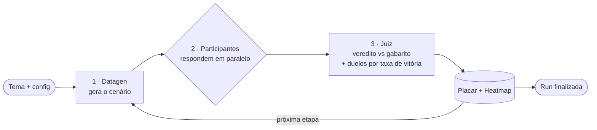
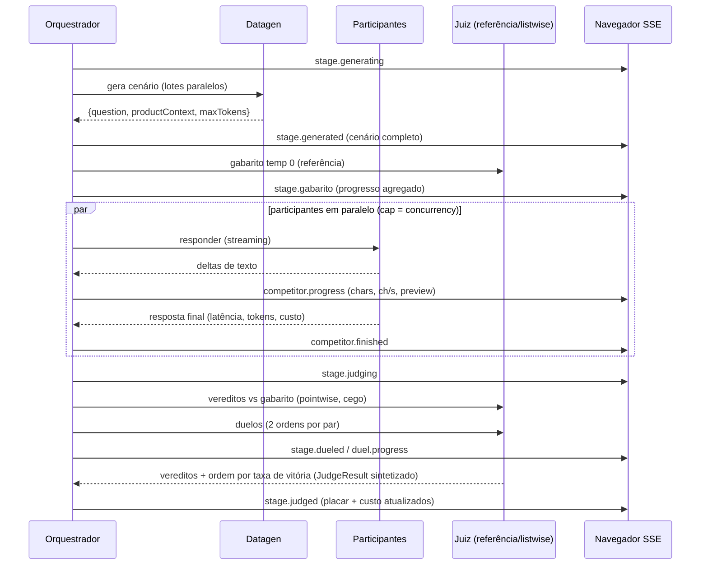

# Prompt Builder

Arena de benchmark **paralelo** de LLMs sobre a [OpenRouter](https://openrouter.ai). Em três
modos: **comparar** vários modelos no mesmo desafio, **testar** vários prompts em um modelo, ou
**treinar** um prompt que evolui sozinho. Você dá um **tema**, o sistema **gera cenários** com um
modelo, faz os **participantes** responderem ao mesmo tempo, um **modelo juiz** ranqueia às cegas e
a interface mostra **placar, heatmap, custo e o texto sendo gerado token a token** — tudo ao vivo (SSE).

> **Em uma frase:** "dado um tema, descubra qual modelo (ou qual prompt) responde melhor — e quais
> respostas são boas o bastante para usar no trabalho de verdade — com evidência, ranking e custo."

## CLI para agentes de programação (`prompt-builder`)

Publicado no npm. Feito para ser dirigido por **Claude Code, Codex, opencode, Cursor, Gemini CLI** —
sem prompt interativo, `--json` em tudo, e auto-documentação versionada dentro do próprio pacote.

```bash
# a ferramenta ensina o agente a usá-la (docs embarcadas, casadas com a versão)
npx prompt-builder-cli docs quickstart

# descobre o modelo do ambiente e QUAIS níveis de raciocínio ele aceita
npx prompt-builder-cli models show anthropic/claude-opus-5 --json

# pré-voo inteiro SEM gastar nada (e sem key): recusa com o MESMO código da run real
npx prompt-builder-cli train --config arena.json --budget 3 --dry-run --json

# treina com teto de gasto, emitindo um evento JSON por linha
npx prompt-builder-cli train --config arena.json --budget 3 --output-format ndjson

# instala a skill no repositório (.claude/skills, .agents/skills)
npx prompt-builder-cli init --agent all
```

Também expõe um **servidor MCP** no mesmo binário:

```bash
claude mcp add --transport stdio arena -- npx -y prompt-builder-cli mcp
```

Runs levam minutos e os clientes MCP cortam uma chamada em ~60 s, então o caminho é por
**job**: `start_run` devolve o `jobId` na hora (a run roda em segundo plano, uma por processo,
as demais em fila), `run_status` acompanha e `cancel_run` interrompe. `idempotencyKey` é
obrigatória no `start_run`: um retry com a MESMA chave — até de outro processo — devolve o mesmo
job em vez de pagar uma segunda run. `run_benchmark`/`train_prompt`/`run_agent_benchmark`
continuam, mas esperam no máximo ~25 s e então devolvem o `jobId`. Cliente que declara a
extensão `io.modelcontextprotocol/tasks` recebe uma task (`tasks/get`, `tasks/cancel`).

Cancelar (`cancel_run`, `tasks/cancel` ou `notifications/cancelled` da chamada) interrompe a run
na hora: nenhuma chamada paga nova sai, o parcial fica gravado como `aborted`
(`stoppedReason: "cancelled"`) e é lido por `get_result`. Fechar o stdin ou mandar `SIGTERM` faz
o mesmo com até ~10 s de graça; um job que passa do prazo (`ttlSeconds`, padrão 2 h) também.

Três coisas que o CLI garante e a UI não garantia:

- **Custo real.** O gasto sai de `usage.cost` (o valor cobrado), quebrado por papel — juiz,
  gabarito, duelos e reescritor incluídos. Antes só as respostas dos competidores eram contadas,
  subcontando o total por um múltiplo.
- **Orçamento que não corrompe o resultado.** Ao estourar o teto, a run para numa fronteira de
  fase e entrega o parcial honesto (exit `7`), em vez de virar uma run "concluída" com vereditos
  inventados por falta de dinheiro.
- **Think levels do catálogo.** `models show` diz exatamente quais degraus aquele modelo aceita e o
  que vai no fio para cada nível pedido — é o que permite a um agente treinar contra o próprio
  modelo sem tomar HTTP 400.

Evolução de prompts com **dataset estável e cinto de segurança** (paridade com o
prompt-arena):

- **Biblioteca de cenários** (`prompt-builder library`) — banco persistente de cenários+
  gabaritos por perfil, com `tier`/`dimensionTags`/`expected` (rótulo = veredito determinístico
  sem juiz). `scenarios: {"from":"library","profile":…}` no config faz o evolve rodar sempre
  sobre o MESMO dataset — e recusa item sem gabarito.
- **Contratos never-break** (`prompt.contracts`) e **multi-prompt** (`prompt.group`/`promptId`,
  coordinate ascent com irmãos congelados) — a evolução não quebra o prompt de produção.
- **Pool Pareto** (`training.paretoPool`), **reflexão GEPA por LLM** (`training.reflection`),
  **`repeats`** para medir instabilidade — seleção de população, não campeão único.
- **Reprodutibilidade**: `runs reproduce` (config + comando exato), `runs export` (artefato
  auto-contido), `sessions winner --apply` (handoff com backup+diff+commit) e `registry validate`
  (guarda de drift do prompt em código).
- **Ciclo de vida dos modelos**: toda run grava `canonicalSlug`/`expirationDate`/`aliasTarget`
  do catálogo e alerta 30/14/7 dias antes da expiração; `baseline check` é o gate de CI que
  reprova quando juiz/gabarito mudam ou somem sem re-baseline declarada (`docs lifecycle`).

Documentação completa: `npx prompt-builder-cli docs --list`.

---

Convenções para **agentes de código** (Claude Code, Codex, Cursor…) estão em [`AGENTS.md`](./AGENTS.md),
na biblioteca de skills em [`.agents/skills/`](./.agents/skills/) e na **memória CoALA** do projeto —
veja [Skills e memória CoALA](#skills-e-memória-coala). (A antiga documentação em `docs/`/`TELAS.md`
foi consolidada na memória em 2026-09-26.)

---

## Sumário

- [Como funciona (visão geral)](#como-funciona-visão-geral)
- [Os três modos](#os-três-modos)
- [Os papéis dos modelos](#os-papéis-dos-modelos)
- [Conformidade LGPD (allowlist por endpoint)](#conformidade-lgpd-allowlist-por-endpoint)
- [Anatomia de uma etapa](#anatomia-de-uma-etapa)
- [Sistema de pontuação](#sistema-de-pontuação)
- [Stack tecnológica](#stack-tecnológica)
- [Estrutura do projeto](#estrutura-do-projeto)
- [Skills e memória CoALA](#skills-e-memória-coala)
- [Configuração](#configuração)
- [Como rodar](#como-rodar)
- [Fluxo de eventos (SSE)](#fluxo-de-eventos-sse)
- [Referência da API](#referência-da-api)
- [Persistência](#persistência)
- [Exportação CSV](#exportação-csv)
- [Resiliência ("overkill")](#resiliência-overkill)
- [Segurança da API key](#segurança-da-api-key)
- [Notas e limitações](#notas-e-limitações)

---

## Como funciona (visão geral)

O backend orquestra um **pipeline em etapas**. Você define `N` etapas; cada etapa é um
mini-benchmark independente e auto-contido:



1. **Datagen** — um modelo recebe o tema (e um `scenarioBrief` opcional) e produz os **cenários**
   em lotes paralelos: uma pergunta de usuário (`question`), um **contexto de produto**
   (`productContext`: políticas, FAQs, dados, restrições — entregue ao participante como bloco de
   dado delimitado antes da pergunta; a variante sob teste é o único *system prompt*) e um teto de
   tokens sugerido (`maxTokens`). Cada etapa varia o tipo de tarefa (extração, raciocínio,
   comparação, recusa…). Um **pacote de cenários** importado vira seed e mescla com os gerados.
2. **Participantes** — respondem **ao mesmo cenário em paralelo** (com limite de concorrência),
   em *streaming*. A UI mostra o texto crescendo, a velocidade (chars/s), latência, tokens e custo.
3. **Julgamento** — por default (fora do compare clássico) é **por referência**: um **gabarito**
   temp-0 é gerado por cenário, o juiz classifica cada resposta isoladamente contra ele
   (**resolve / parcial / não**, com explicação de 1 frase; com 2+ juízes vale a **maioria
   simples**, e painel dividido é **empate técnico**, nunca arredondado para cima) e os melhores
   disputam **duelos** classificados por **taxa de vitória** (cada par nas duas ordens; empate em
   desacordo). Sem gabarito (ou no compare
   clássico), cai no **juiz listwise** clássico: ordena as respostas às cegas e dá o veredito de
   aceitabilidade ("dá para usar em produção sem causar erro/dano?").
4. **Todas as etapas rodam em paralelo** (cenários pré-gerados juntos; execução concorrente
   limitada por um semáforo global adaptativo). O placar é aditivo, então a ordem de término não
   importa; ao final a run é `finished` e fica no histórico (com export JSON/CSV).

Tudo é transmitido ao navegador em tempo real via **Server-Sent Events (SSE)**: durante a run a tela
mostra um **visualizador de processo** (etapas em paralelo + previews ao vivo) e revela o **placar /
heatmap só quando tudo termina**. Detalhes do motor em [`FUNCIONAMENTO.md`](./FUNCIONAMENTO.md).

---

## Os três modos

O assistente de **Nova Run** tem 5 passos (Objetivo → Tema → Participantes → Avaliação → Revisar)
e atende três objetivos. O que muda é **quem é o "participante"** (`Contestant`):

| Modo | O que compara | Participante | Endpoint | Requisito |
|---|---|---|---|---|
| **Comparar modelos** (`compare`) | Vários **modelos**, mesmo desafio | cada modelo (id === modelId) | `POST /runs` | ≥ 2 `competitorModelIds` |
| **Testar prompts** (`variation`) | **Um modelo**, vários *system prompts* | mesmo modelId, `systemPrompt` distinto | `POST /runs` | 1 `contestantModelId` + ≥ 2 variações |
| **Treinar prompt** (`training`) | Um prompt que **evolui** por iteração | idem variation, encadeado | `POST /sessions` | + `iterations` (2–10) |

- **Variação** gera as versões do prompt de dois jeitos: **otimização ligada** → um modelo
  *optimizer* reescreve o `basePrompt` aplicando **técnicas** selecionadas (`techniqueIds`, biblioteca
  curada em `src/techniques.ts`); **desligada** → você escreve as variações manualmente
  (`manualVariants`). Um `basePrompt` opcional roda como **controle**.
- **Treino** repete a variação por `N` iterações (`src/trainer.ts`): a melhor versão de cada rodada
  é a semente da próxima — mas **só é promovida se superar o campeão por `minGain`** (default 1
  p.p.); sem margem, a sessão **converge** e para. Os cenários são **congelados** após a iteração 0
  (`pinnedStages`, com split de **holdout**) para comparação justa; o feedback vem de **lições
  determinísticas** das falhas do campeão (sem LLM extra). Ao final, uma run de **holdout** e um
  **teste pareado exato** (troca de sinais + IC por inversão) validam o campeão. Acompanhe em
  `TrainingView`.
- Nos modos de um modelo, o **juiz nunca é o modelo sob teste** (anti-viés de auto-preferência), e
  há a opção **"juiz em 2 ordens"** (`judgePasses: 2`) contra viés de posição.

`RunConfig` é uma **união discriminada por `mode`** (`src/types.ts`), validada por Zod em
`src/routes.ts`.

---

## Os papéis dos modelos

Toda run tem **modelos de apoio** (gerador + juiz) além dos participantes:

| Papel | Quantos | O que faz | Configuração |
|---|---|---|---|
| **Participante** | compare: **≥2** (ou 2–12 configs); variation/training: **1** (+ variações) | Respondem ao cenário e disputam o ranking | `competitorModelIds[]` / `competitorConfigs[]` / `contestantModelId` |
| **Gerador (datagen)** | exatamente **1** | Inventa os cenários (pergunta + contexto + maxTokens) | `datagenModelId` |
| **Juiz** | **1 ou mais** | Vereditos vs gabarito + duelos (ou ranking listwise, no fallback) | `judgeModelIds[]` |
| **Referência (gabarito)** | 1 (**obrigatório** em variation/training; em compare o default = 1º juiz) | Gera a resposta de referência temp-0 por cenário | `referenceModelId` |
| **Optimizer** | 1 (variation/training) | Reescreve prompts aplicando técnicas | `optimizerModelId` (default = `datagenModelId`) |

**Regras validadas no backend** (Zod) — config inválida é recusada com `400`:

- compare: ≥ **2 competidores distintos**; gerador ≠ juiz; nem gerador nem juiz são competidores.
- variation/training: ≥ 2 variações (técnicas ou manuais, contando o `basePrompt` como controle);
  **juiz ≠ modelo sob teste**.
- **papéis separados (IMPL-048):** a referência **não pode ser juiz nem competidor** (erro de
  config — o mesmo modelo escreveria o gabarito e o veredito sobre ele, com erros correlacionados);
  o mesmo vendor/família só gera **aviso** de viés em `fairnessWarnings`. `referenceModelId` é
  **obrigatório em variation/training**; em compare o default documentado (1º juiz) é denunciado
  pelo mesmo aviso, nunca escondido.
- **esforço de raciocínio por papel (IMPL-079):** `reasoning.judge` / `reasoning.duel` /
  `reasoning.gab` **não compartilham mais um campo só**. Defaults: juiz pointwise **`medium`**,
  duelo **`low`** e gabarito **`high`** (acima de `low` o ganho de esforço satura ou reverte e o
  papel juiz domina o custo). Papel sem campo próprio cai no `reasoning.judge` antigo (compat) e,
  sem nenhum dos dois, no default do papel — sempre com `fitEffort` na allowlist do modelo. Exemplo
  de config (judge=medium, duel=low, gab=high):

  ```json
  "reasoning": { "competitor": "low", "judge": "medium", "duel": "low", "gab": "high" }
  ```

---

## Conformidade LGPD (allowlist por endpoint)

No passo **Tema** do assistente há um bloco **"Conformidade LGPD"** que **filtra o catálogo de
modelos** conforme a área de uso — útil porque este repositório é do **Grupo Fleury** (dados de
saúde = sensíveis). Você escolhe uma **área** (Geral, Jurídico, Saúde, Financeiro, Crianças e
adolescentes, Setor público — ou **"Livre"**, que mostra tudo) e um **rigor** (incluir ou não
modelos "permitido com ressalvas").

A unidade da política é o **endpoint** (provedor + região/variante), como no OpenRouter — não o
criador do modelo:

- **Áreas sensíveis** (todas menos Geral) são **fail-closed**: um modelo só passa com criador
  conhecido **e** ≥ 1 endpoint ZDR de provedor mapeado no snapshot. Desconhecido ⇒ bloqueado
  (criador fora da base, provedor fora do mapa, modelo que surgiu depois da geração, área
  inexistente). Snapshot com mais de **90 dias** (alvo 30) bloqueia a área inteira.
- A run/sessão sensível passa por um **pré-voo** antes de qualquer chamada de LLM: se QUALQUER
  papel que vê o dado (competidor, juiz/duelo, gerador, gabarito, reescritor) estiver fora da
  allowlist, ela é recusada com o papel e o motivo na mensagem.
- **Geral** segue consultiva (classificação por criador; China/SG → não recomendado).

- **Roteamento forçado (modo "dados sensíveis", fail-closed):** em área sensível, TODA requisição
  dos 6 papéis sai com `provider: { zdr: true, data_collection: "deny", only: [tags ZDR da
  allowlist do modelo], allow_fallbacks: false }` — sem fallback silencioso para endpoint que
  retém dados. Se faltar qualquer um dos 4 campos (modelo sem rota, snapshot ausente/vencido), a
  chamada é recusada **antes** do envio. Ponto único: o gateway (`src/engine/sensitiveRouting.ts`,
  aplicado em `OpenRouterGateway.buildBody`), igual no CLI/servidor e na SPA — inclusive o
  "Gerar prompt base" da tela Nova Run. **Modo agente não roda em área sensível:** o executor do
  agente (`pi`) chama o provedor por fora do gateway e não enviaria os 4 campos, então o pré-voo
  recusa a run (`roteamento_incompleto`) antes de qualquer LLM. As tags de cada modelo:
  `models allowlist --area saude`.

> ⚠️ **Não é aconselhamento jurídico.**

- Classificação: **um só** núcleo puro, [`src/engine/lgpdCore.ts`](./src/engine/lgpdCore.ts),
  usado pelo CLI/servidor (`src/lgpd.ts`), pela SPA (`web/src/lgpd.ts`) e pelo gerador.
- Base de conhecimento: [`src/data/lgpd-compliance.json`](./src/data/lgpd-compliance.json) (áreas
  com `sensivel`, famílias, origem de providers/criadores, status ANPD, config ZDR recomendada).
- Snapshot por endpoint (consumido em runtime, viaja no pacote npm):
  [`src/data/lgpd-allowlist.generated.json`](./src/data/lgpd-allowlist.generated.json).
- Regenerar: `npm run lgpd:allowlist` (endpoints **públicos** `/models` e `/endpoints/zdr` — sem
  key). A CI regenera toda semana e abre PR (`.github/workflows/lgpd-allowlist.yml`).
- Conferir idade e contagens: `prompt-builder models allowlist --check [--max-age 30] [--json]`
  (exit 3 se vencida/ausente ou com desconhecido liberado).
- Servido em `GET /v1/benchmark/lgpd`.

### Dado pessoal: redação obrigatória e modo "só sintético"

Toda chamada de LLM — dos 6 papéis (gerador, gabarito, competidor, juiz, duelo, reescritor), no
CLI, no servidor e na SPA — passa por uma **cascata PT-BR** no ponto único do gateway
([`src/engine/pii.ts`](./src/engine/pii.ts)) **antes** do envio:

1. **Identificadores estruturados** (regex + dígito verificador mod-11 onde existe): CPF, CNPJ
   (inclusive o **alfanumérico** de jul/2026), CNS, RG, CEP, telefone, e-mail e CRM saem
   **pseudonimizados** (`[CPF_1a2b3c4d5e6f]` — o mesmo documento em qualquer formatação vira o
   mesmo token). O token é **HMAC-SHA-256 com chave secreta de 256 bits por run/sessão**: conhecer
   pares valor→token (o CPF que o próprio modelo gerou volta pseudonimizado) não permite prever
   nem reverter outro token, e runs diferentes não se ligam pelo mesmo titular. Placeholders
   (`(11) 99999-9999`), exemplos notórios e números de serviço (0800/4004) não mexem.
2. **Nomes e endereços** (heurística local de dicionário + gatilhos — **não** um NER): detectados
   e contados, **não reescritos** — marcados **"não coberto"**: não há promessa de recall (a
   literatura mede ~49% para nomes em texto livre). Se os seus dados têm nomes reais, use o modo
   "só sintético".
3. **Aparência de dado real** ⇒ **bloqueio com aviso nomeando o campo**, nunca correção silenciosa:
   identificador forte realista (CPF, CNS, RG com rótulo de identidade, CRM, celular, e-mail pessoal) ou "ficha" de titular
   (nome + identificador forte, ou nome + ≥2 dados fracos como endereço + CEP). Nome de **persona**
   do prompt ("Você é a Ana Paula, atendente… Rua Augusta, 1500") e contato comercial viram só
   aviso. Vale na **importação** — JSON de cenários, pacote, `arena-config@1`, `arena-agent-config@1`
   e **RunConfig cru** (CLI `--config`/flags, `estimate`, `config validate`, MCP, `POST /runs` e
   `/sessions`), `library add` e `library seed --file` — e de novo no **pré-voo** da run (SPA inclusive).

**Modo "redigir"** (padrão): o bloqueio acima exige **revisão explícita** — `allowPii: true` no
config (CLI `--allow-pii`; SPA: "Revisei — importar/iniciar mesmo assim"). Revisado, os
identificadores seguem pseudonimizados no envio e **voltam ao valor original nas respostas**
(reversão fora do caminho de envio: o mapa token→valor vive só em memória, por run/sessão) — o
prompt campeão, o cenário e o gabarito nunca carregam token, e `neverBreak` com o valor original
continua valendo. Dado de empresa (CNPJ, fixo, CEP, e-mail funcional) nem pede revisão, mas sai
pseudonimizado do mesmo jeito e a tela da run diz isso. O record guarda em `piiReport` os campos achados
(caminho + tipos, **nunca o valor**); o CLI narra o mesmo no stderr. Nomes em texto livre seguem
como estão. **Modo "só sintético"** (`piiMode: "synthetic"`; `--pii-mode synthetic`; switch em
Avançado na Nova Run): a run/sessão é **recusada**, antes de qualquer LLM, sem exceção manual. O
**modo agente** (executor `pi`, que fala com o provedor por conta própria, fora do gateway) é
sempre tratado como "só sintético" — fail-closed para dado de aparência real. ⚠️ O que é só
**aviso** (CNPJ, fixo, CEP, e-mail funcional, nome) passa no pré-voo e, no **executor**, segue
**cru** para o provedor (nos demais papéis sai pseudonimizado); o CLI e a tela da run avisam. O
ground truth determinístico (`expected`) compara a resposta reidratada com o rótulo cru.

Medido na fixture própria [`test/fixtures/pii-ptbr.json`](./test/fixtures/pii-ptbr.json)
(353 casos): recall 0,98 e precisão 1,00 nos estruturados, 0% de falso positivo no bloqueio
(`test/lgpd-pii.test.ts`).

Detalhes para agentes na memória CoALA do projeto (`coala.py search "lgpd"`).

---

## Anatomia de uma etapa



Pontos-chave (`src/orchestrator.ts`):

- **Datagen em lotes:** cenários pré-gerados em paralelo (`generateStages`), com dedup ROUGE-L e
  backfill; falha de uma etapa **pula a etapa** — a run **nunca trava**.
- **Cego (blind):** antes do juiz, as respostas são **embaralhadas** e rotuladas
  `A, B, C…` — o juiz não sabe qual modelo é qual. A UI mostra "(era A)" depois (no fluxo listwise).
- **Referência com fallback:** etapa sem gabarito (ou compare clássico) cai no juiz **listwise**;
  o resultado do julgamento por referência é **sintetizado num `JudgeResult`** para placar e UI.

---

## Sistema de pontuação

Há **duas leituras complementares** de cada run:

### 1. Ranking competitivo (juiz) → placar e heatmap

A cada etapa, o juiz ordena as respostas. Pontuação estilo "corrida":

> Com **N** respostas válidas: 1º lugar = **N−1** pontos, 2º = **N−2**, … último = **0**.
> Os pontos são **somados em todas as etapas** (`src/orchestrator.ts` → `applyScoreboard`).

O **heatmap** mostra a posição de cada participante em cada etapa, do **verde** (melhor) ao
**vermelho** (pior); `·` = "não ranqueado". A classificação final ordena por: **pontos** →
**posição média** → **nº de 1ºs lugares** → id.

### 2. Vereditos de aceitabilidade → "dá pra usar no trabalho?"

Independente do ranking, cada resposta recebe um **veredito**:

- ✅ **resolve** — resolve a necessidade de forma correta e segura, **mesmo não sendo a melhor**;
- ◐ **parcial** — serve em parte (falta algo ou desvia do contexto);
- ❌ **não** — erro factual, viola contexto/política, ou incompleta a ponto de não servir.

"**Aceitável**" = veredito ≠ `não`. Respostas com **erro/vazias** são automaticamente **não
aceitáveis** (sem gastar chamada de LLM). No julgamento por referência o veredito é **pointwise
contra o gabarito**; no listwise, vem do próprio juiz.

> É a diferença entre "**quem ganhou**" (ranking) e "**quem serve**" (aceitabilidade): um modelo
> pode quase nunca vencer e ainda assim ser aceitável em 100% das etapas.

---

## Stack tecnológica

**Backend**

- **Node.js** (ESM, `"type": "module"`, `NodeNext` — imports relativos com extensão `.js`) + **Express 4**.
- **TypeScript 5** (strict) — compilado para `dist/`.
- **Zod 4** — validação do corpo das requisições e dos JSONs devolvidos pelas LLMs.
- **`fetch` nativo** — chamadas à OpenRouter (sem SDK), inclusive **streaming SSE**.
- **`EventEmitter` nativo** — barramento de eventos por run/sessão (`src/events.ts`).
- Sem banco de dados: **persistência em arquivos JSON** (`data/runs/*.json`, `data/sessions/*.json`).

**Frontend** (`web/`)

- **React 18** + **React Router 6** — SPA com 5 telas.
- **Vite 5** — dev server (proxy de `/v1` e `/health`) e build.
- **TypeScript 5**; **`EventSource`** (SSE) para acompanhar ao vivo.
- **Cache em IndexedDB** (`web/src/idb.ts`, db `prompt-builder`) — fallback offline do histórico.
- **CSS puro** (`web/src/styles.css`) com **design tokens** e tema **claro/escuro**, sem framework de UI.

**Integração externa**

- **OpenRouter** — gateway único para todos os modelos. Catálogo + preços via `GET /models`;
  geração via `POST /chat/completions` (streaming p/ participantes, JSON-mode p/ datagen/juiz);
  validação de key via `GET /key`. `/models` e `/endpoints/zdr` são **públicos**.

---

## Estrutura do projeto

```
prompt-builder/
├─ src/                      # Backend (TypeScript → dist/)
│  ├─ server.ts              # Express, /health, monta /v1/benchmark, serve web/dist, aborta órfãs
│  ├─ routes.ts              # Endpoints /v1/benchmark/* + validação Zod + SSE + CSV
│  ├─ orchestrator.ts        # Loop da run: datagen → participantes → juiz+avaliador → placar
│  ├─ trainer.ts             # Modo training: encadeia N iterações (sessão)
│  ├─ variator.ts            # Gera variações de prompt (técnicas / manuais)
│  ├─ datagen.ts             # Gera o cenário (question/productContext/maxTokens)
│  ├─ competitor.ts          # Roda 1 participante (streaming, retry, progresso, custo)
│  ├─ judge.ts               # Juiz listwise (fallback — ranking cego + vereditos)
│  ├─ gabarito.ts / refJudge.ts / duels.ts   # Julgamento por referência: gabarito, vereditos pointwise, duelos (taxa de vitória)
│  ├─ rank.ts / holdout.ts / stats.ts        # Promoção (minGain), holdout, significância pareada exata
│  ├─ llmVariants.ts / reasoning.ts / dedup.ts / scenarioPack.ts   # compare-llms, reasoning por papel, dedup, pacote de cenários
│  ├─ openrouter.ts          # Cliente OpenRouter: models, chat, stream, custo, validateKey
│  ├─ techniques.ts          # Biblioteca curada de técnicas de prompt
│  ├─ lgpd.ts                # Base LGPD + allowlist do pacote e pré-voo da run (Node)
│  ├─ engine/lgpdCore.ts     # Núcleo PURO da LGPD: classificação ÚNICA, allowlist por endpoint, pré-voo
│  ├─ engine/pii.ts          # Núcleo PURO de dado pessoal PT-BR: detecção (DV mod-11), pseudonimização, bloqueio
│  ├─ events.ts / normalize.ts / storage.ts / types.ts
│  └─ data/                  # JSON estático VERSIONADO (lgpd-compliance, lgpd-allowlist.generated)
│
├─ web/                      # Frontend (React + Vite)
│  └─ src/
│     ├─ main.tsx            # Router, layout, navegação
│     ├─ api.ts              # Cliente HTTP/SSE + tipos + key no localStorage
│     ├─ idb.ts              # Cache IndexedDB v2 (incl. store `prompts`); theme.ts / help.ts (contexts)
│     ├─ lgpd.ts             # Shim do núcleo LGPD + loader do bundle (SPA)
│     ├─ styles.css          # Design tokens (claro/escuro)
│     ├─ components/         # ModelSelector, Toggle, TechniqueSelector, ManualVariantsEditor, KeySetup, HelpModal
│     └─ pages/              # NewRun (assistente 5 passos), RunsList, RunView, TrainingView, PromptsPage, Settings
│
├─ scripts/gen-lgpd-allowlist.mjs   # Regenera a allowlist LGPD por endpoint (npm run lgpd:allowlist)
├─ .agents/skills/          # Biblioteca de Knowledge Skills (fonte única) — ver seção abaixo
├─ .claude/skills           # symlink → ../.agents/skills (portabilidade Claude Code)
├─ AGENTS.md                # Instruções mínimas para agentes de código (CLAUDE.md é symlink)
├─ data/                    # runtime: runs/ e sessions/ (gitignored — regra /data/)
├─ .env.example             # Variáveis OPCIONAIS (o app roda sem .env)
├─ README.md  ·  TELAS.md   # Este arquivo · documentação das telas
└─ package.json  ·  tsconfig.json
```

---

## Skills e memória CoALA

O conhecimento do projeto vive na **memória CoALA local**
([`.agents/prompt-builder-coala-memory-agent-skill/`](./.agents/prompt-builder-coala-memory-agent-skill/)):
uma base SQLite com busca híbrida (FTS5 + vetor, fusão RRF), memória **episódica, semântica e
procedimental**, working memory orçamentada, proveniência (`owner`/`agent`/`untrusted`) e supersessão.
As antigas *knowledge skills* (`knowledge-*`) e o `project-router` foram **destiladas para essa
memória** (chaves `skill:<nome>:<tema>`) e apagadas em 2026-09-27; o conteúdo das 32 deep researches
técnicas e dos documentos do projeto também está lá (chaves `R-xx:DEC-n`, `R-xx:REC-n`, `docs:Q-xx`,
`docs:pivo-P-x`, …).

**Como usar (agentes de código):** no início de cada tarefa,
`python3 .agents/prompt-builder-coala-memory-agent-skill/scripts/coala.py recall "<tarefa>" --budget 1500`;
para dúvidas pontuais, `coala.py search "<termos>"`; no fim, registar o durável com `coala.py add`.

```
.agents/skills/                              (fonte única; .claude/skills é symlink)
├─ prompt-builder-coala-memory-agent-skill/  memória CoALA local (conhecimento do projeto)
├─ task-*/                                   memória procedural (terminam com <evolution> + LEARNINGS.md):
│                                            add-endpoint, edit-newrun-form, run-and-verify
├─ meta-skill-evolution/                     decide o destino de aprendizados novos (via git diff)
├─ meta-skill-consolidate/                   GC periódico: dedup, contradições, versionamento, poda
└─ catalog.md                                índice · skill-template.md  modelo
```

**Memória evolutiva com salvaguardas:** skills de tarefa terminam com um passo `<evolution>` que
destila aprendizados em `LEARNINGS.md`. Inspirado em Voyager (persistir só após verificação) e
Reflexion (feedback verbal). **Gate humano inegociável:** toda atualização de skill (ou registro
durável na memória) é um *commit* separado para revisão por `git diff` — pesquisa da ETH Zurich
(arXiv:2602.11988) mostra que contexto auto-gerado *sem curadoria* piora o desempenho do agente.
As skills aqui são **rascunhos curados**: trate-as como tal e revise antes de confiar.

**Portabilidade:** fonte única em `.agents/skills/`, frontmatter mínimo (`name` + `description`),
symlinks versionados. Começo: [`AGENTS.md`](./AGENTS.md) (comandos exatos + regras não-óbvias),
[`catalog.md`](./.agents/skills/catalog.md) e a memória CoALA.

---

## Configuração

**Não é preciso nenhum `.env` para rodar** — todos os parâmetros têm default. A **chave do
OpenRouter não vai em variável de ambiente**: você cola na interface (tela de **Configurações** /
*gate* da Nova Run) e ela fica no `localStorage` do navegador, indo ao backend só no header
`x-openrouter-key`.

Variáveis **opcionais** (veja `.env.example`):

| Variável | Default | Para quê |
|---|---|---|
| `OPENROUTER_BASE_URL` | `https://openrouter.ai/api/v1` | Apontar para um proxy/gateway compatível |
| `OPENROUTER_APP_URL` | `http://localhost:3000` | Header `HTTP-Referer` de atribuição |
| `OPENROUTER_APP_TITLE` | `Prompt Builder` | Header `X-Title` de atribuição |
| `BENCHMARK_PORT` | `3001` | Porta do backend |
| `PB_HOST` (ou `--host`) | `127.0.0.1` | Interface de bind do backend. Fora de localhost é pedido explícito (aviso no log); com `PROMPT_BUILDER_AGENTS=1` o servidor **recusa** subir fora de localhost. `HOST` **não** vale para o bind (containers/CI exportam o hostname nele): se estiver definido fora de localhost, só gera um aviso — e, no modo agente, a recusa |
| `PB_ALLOWED_HOSTS` | — | Nomes extras aceitos no header `Host`/`Origin`, separados por vírgula (ex.: túnel ou proxy). Sem isso, só `localhost`/`127.0.0.1`/`::1` — o resto leva 400/403 (proteção contra DNS rebinding) |
| `OPENROUTER_MAX_CONCURRENCY` | `32` | Teto do limitador global adaptativo de chamadas ao OpenRouter |

Parâmetros da **run** (na tela de Nova Run, validados no backend):

| Campo | Faixa | Default (UI) |
|---|---|---|
| `stages` (etapas) | 1–50 | 5 |
| `iterations` (treino) | 2–10 | 3 |
| `concurrency` | 1–32 | 8 |
| `timeoutMs` | 1.000–300.000 | 60.000 |
| `maxOutputTokens` | 50–16.000 | 500 |

`maxOutputTokens` é um **teto absoluto**; o efetivo é `min(maxOutputTokens, maxTokens do datagen)`.

> A concorrência efetiva das chamadas ao OpenRouter é governada por um **limitador global
> adaptativo** (`OPENROUTER_MAX_CONCURRENCY`); o campo `concurrency` por run é legado (não limita
> mais o paralelismo). Ver [`FUNCIONAMENTO.md`](./FUNCIONAMENTO.md).

---

## Como rodar

Um **único `npm install`** instala backend **e** front (`postinstall` cuida do `web/`).

### Desenvolvimento

```bash
npm install
npm run dev      # backend :3001 (tsx watch) + Vite :5173 (proxy de /v1 e /health)
```

Abra **`http://localhost:5173`** e cole sua chave OpenRouter na tela de setup.

### Produção

```bash
npm install
npm run build    # compila backend (dist/) e front (web/dist/)
npm run start    # serve API + frontend juntos em http://localhost:3001
```

Em produção o Express serve `web/dist` e faz *fallback* de SPA para rotas que não comecem com
`/v1` ou `/health`.

### Deploy estático (Vercel) — modo client-side

Há também um **modo 100% client-side**: o pipeline foi portado para **`web/src/engine/`**, então o
navegador chama o OpenRouter **direto** (CORS liberado), orquestra os runs na própria aba e persiste
no **IndexedDB** — sem backend stateful. Isso permite hospedar a SPA **estática** (ex.: Vercel) via
[`vercel.json`](./vercel.json) (build `npm run web:build`, output `web/dist`, SPA rewrite). Por que
isso importa: serverless é efêmero/stateless, então um servidor de run de minutos não roda lá; no
client-side a aba é o "processo vivo".

> ⚠️ **Não publique o backend `src/` na Vercel.** Ele persiste runs no filesystem (`data/runs/*.json`
> via `storage.ts`), que no serverless é efêmero/read-only e não-compartilhado entre invocações: o
> deploy *parece* ok (serve a SPA e responde `/health`), mas `GET /v1/benchmark/runs/:id` devolve
> `Run nao encontrada`. **Sintoma de deploy errado:** `/health` responde JSON
> (`{"status":"ok",…}`) em vez do `index.html` da SPA — é um deploy antigo do backend preso em
> produção; force um novo deploy estático.

**Trade-offs:** a aba precisa ficar aberta durante a run, e o
histórico é por navegador/dispositivo. O backend `src/` continua disponível como alternativa (host de
processo persistente: Railway/Render/Fly), mas **não é usado** pela SPA estática.

### Scripts (`package.json`)

| Script | O que faz |
|---|---|
| `npm run dev` | Backend (watch) + Vite, em paralelo (`concurrently`) |
| `npm run build` | `tsc` do backend + `tsc -b && vite build` do front |
| `npm run start` | Roda o backend compilado (`dist/server.js`) |
| `npm run web:dev` / `web:build` / `web:install` | Atalhos para `web/` |
| `npm test` | **Testes de contrato** (vitest): núcleo de evolução, config, orçamento e guarda de sincronia do motor |

> Verificação = `npm test` + type-check (`npx tsc -p tsconfig.json --noEmit` e `cd web && npx tsc -b`)
> + execução manual. Os testes de contrato **travam o comportamento determinístico** (seeds,
> desempates, pisos) e os whitelists silenciosos (`variationConfigFrom`, `normalizeRunRecord`) —
> rode-os antes e depois de qualquer refactor do pipeline.

---

## Fluxo de eventos (SSE)

O backend mantém um **barramento de eventos por run** (`src/events.ts`). Ao abrir
`GET /v1/benchmark/runs/:id/events`, o cliente recebe um `snapshot` e depois o *stream* incremental.

| Evento | Quando | Carrega |
|---|---|---|
| `snapshot` | Ao conectar | Record completo |
| `run.started` | Início | Record inicial |
| `stage.generating` / `stage.generated` | Datagen | `stageIndex` / `spec` |
| `stage.failed` | Datagen falhou (etapa pulada) | `error` |
| `competitor.started` / `competitor.progress` / `competitor.finished` | Participante | `modelId` / `chars`,`charsPerSec`,`preview` / `response` |
| `stage.judging` / `stage.judged` | Juiz | `stageIndex` / `judge`,`evaluation`,`scoreboard`,`totalCostUsd` |
| `stage.gabarito` / `stage.dueled` / `duel.progress` | Julgamento por referência | progresso agregado / `duels` da etapa |
| `run.finished` / `run.error` | Fim / erro | Record final / `error` |

Sessões de **treino** têm eventos análogos (`session.started`, `iteration.started/finished`,
`iteration.promoted`, `session.converged`, `session.holdout`, `session.finished/error`) em
`GET /sessions/:id/events`.

Runs **terminais** (`finished`/`error`/`aborted`) não abrem stream "vivo": o servidor manda o
evento terminal e fecha; o cliente fecha o `EventSource` (sem reconexão infinita). *Keepalive* a cada 15 s.

---

## Referência da API

Base: `/v1/benchmark`. A key vai no header **`x-openrouter-key`** (quando exigida).

| Método | Rota | Key? | Descrição |
|---|---|:---:|---|
| `POST` | `/validate-key` | header **ou** `body.apiKey` | Valida a key contra `GET /key`; devolve metadados |
| `GET` | `/models` | ✅ | Lista modelos com pricing (cache de 24 h por key) |
| `GET` | `/techniques` | — | Biblioteca curada de técnicas de prompt (sem o meta-prompt) |
| `GET` | `/lgpd` | — | Base de conhecimento de conformidade LGPD |
| `POST` | `/runs` | ✅ | Inicia run `compare`/`variation`; responde **`202 { runId }`** |
| `POST` | `/sessions` | ✅ | Inicia sessão de **treino**; responde **`202 { sessionId }`** |
| `GET` | `/runs` · `/runs/:id` | — | Histórico (resumos) · record completo |
| `GET` | `/runs/:id/events` | — | **Stream SSE** em tempo real |
| `GET` | `/runs/:id/export.csv` | — | Exporta os resultados em CSV |
| `GET` | `/sessions` · `/sessions/:id` · `/sessions/:id/events` | — | Sessões de treino + stream |
| `GET` | `/health` | — | Health check: `{ "status": "ok", "service": "prompt-builder" }` |

**Exemplo — iniciar uma run (compare):**

```bash
curl -X POST http://localhost:3001/v1/benchmark/runs \
  -H "Content-Type: application/json" \
  -H "x-openrouter-key: sk-or-v1-..." \
  -d '{
    "mode": "compare",
    "theme": "Atendimento de clínica de exames com FAQs e políticas",
    "stages": 5,
    "competitorModelIds": ["openai/gpt-5-mini", "openai/gpt-5-nano"],
    "datagenModelId": "deepseek/deepseek-v4-pro",
    "judgeModelIds": ["moonshotai/kimi-k2.6"],
    "concurrency": 8, "timeoutMs": 60000, "maxOutputTokens": 500
  }'
# -> 202 { "runId": "..." }   (acompanhe em /runs/:id/events)
```

> `POST /runs` faz um **pre-flight** da key (valida **antes** de começar) para falhar rápido com
> mensagem clara, em vez de quebrar lá na etapa 1.

---

## Persistência

Runs em `data/runs/<id>.json` e sessões de treino em `data/sessions/<id>.json` (`src/storage.ts`).
`data/` é **gitignored** (regra `/data/`, ancorada para não ignorar `src/data/`) e criado em runtime.

- **Escrita atômica:** grava em `*.tmp` com nome **único por escrita** + `rename` (evita corrupção e
  o `ENOENT` que ocorria quando vários participantes salvavam juntos).
- **Fila por run:** gravações de uma mesma run são **serializadas**.
- **Órfãs viram `aborted`:** ao subir, o servidor marca como `aborted` runs presas em `running`
  (`markOrphansAsAborted`).
- **Cache no cliente:** o frontend espelha resumos/records em **IndexedDB** (`web/src/idb.ts`) — o
  servidor é a fonte de verdade; o cache é fallback offline.
- **Biblioteca de prompts:** prompts salvos (campeões de treino/variação) vivem **só no cliente**,
  na store `prompts` do IndexedDB v2 (`web/src/engine/promptStore.ts`), com versionamento por texto
  — nada disso passa pelo backend.

---

## Exportação CSV

`GET /runs/:id/export.csv` gera **uma linha por resposta de participante**, com escaping correto:

```
runId, sessionId, iteration, stageIndex, question, contestantId, label, technique, modelId,
status, latencyMs, tokensIn, tokensOut, costUsd, rankPosition, errorMsg, text
```

`rankPosition` é a posição (1-based) atribuída pelo juiz naquela etapa (vazio se não ranqueado).

---

## Resiliência ("overkill")

Uma run longa não pode morrer por um soluço de rede ou de um modelo:

- **Etapa isolada:** falha de datagen **pula a etapa**, não mata a run.
- **Datagen com 2 tentativas** e timeout estendido (`max(timeout, 90s)`).
- **Participante com retry** (`retries: 1`); se falhar, vira `status: error` (resposta vazia) e o
  juiz ignora respostas inválidas.
- **Juiz e avaliador em `Promise.allSettled`:** um falhando não derruba o outro nem a run.
- **Casos-limite do juiz:** 0 respostas válidas → inconclusiva; 1 resposta → auto-ranqueada.
- **Escrita atômica + fila por run**; **timeouts via `AbortController`** em toda chamada à OpenRouter.
- **Mensagens de erro traduzidas** (401 = key inválida; 402 = sem crédito; 429 = rate limit).
- **Bloqueio ≠ recusa ≠ erro:** HTTP 403 de moderação/guardrail e `finish_reason` de filtro de
  conteúdo viram `status: blocked` (defesa do gateway — **não** é problema de key nem falha do
  prompt); recusa declarada pelo modelo (`message.refusal`) vira `status: refused` (julgável); o
  resto é `status: error` (infra). O record traz as três contagens em `competitorOutcomeCounts`.
- **Truncamento nunca é silencioso:** o gateway lê `finish_reason`/`native_finish_reason` (JSON e
  stream) + raciocínio ≈ teto + conteúdo vazio com tokens; competidor e gabarito repetem 1x com
  `max_tokens` x2. Resposta ainda truncada deixa a etapa `incomplete` (`incompleteReason:
  truncation`), fora do placar e das médias; o record traz `truncationRate` (todas as chamadas,
  juiz e duelo inclusive), os sinais de fim agregados por papel (`finishSignalsByRole`) e o
  CLI/UI alertam acima de 2% dizendo quais papéis truncaram. Gabarito ainda truncado é
  descartado com aviso visível (a etapa é julgada sem gabarito).

---

## Segurança da API key

- A key **nunca** fica em `.env` nem no servidor: vive no **`localStorage`** do navegador e é
  enviada **só** no header `x-openrouter-key` das chamadas que precisam dela.
- O backend **não persiste** a key — usa na requisição e descarta.
- A validação usa o endpoint **autenticado** `GET /key` (e não `/models`, que é público e
  responderia `200` até para uma key inválida), então uma key ruim é barrada **na hora**.
- O SSE de acompanhamento **não exige key** (a key só é necessária para *iniciar* a run).

---

## Notas e limitações

- **Custo total exibido = todos os papéis do pipeline.** O `totalCostUsd` vem do `BudgetLedger` e
  soma **datagen, gabarito, competidores, juiz, duelos e rewriter** — cada chamada conta pelo valor
  cobrado (`usage.cost`), com fallback no catálogo da OpenRouter (`costAccuracy` diz quantas saíram
  exatas vs estimadas). `costByContestant` é a fatia **só dos competidores**: gasto de juiz/duelo
  não é atribuível a um contestant. Os comandos `runs show`/`sessions show` trazem a quebra por
  papel (`costByRole`).
- **LGPD:** áreas sensíveis bloqueiam o que está fora da allowlist de endpoints ZDR e forçam o
  roteamento por requisição (`provider.only` + `zdr` + `data_collection: deny` +
  `allow_fallbacks: false`); a área "geral" segue consultiva — ver
  [Conformidade LGPD](#conformidade-lgpd-allowlist-por-endpoint). **Não é aconselhamento jurídico.**
- **Sem autenticação de usuário / multiusuário:** ferramenta local; o histórico é compartilhado por
  quem acessa o servidor.
- **Persistência em arquivo** (não em banco): ótimo para uso local, não pensado para alta escala.
- Os **modelos default** na Nova Run são sugestões editáveis — troque pelos que você quer comparar.

---

Para o **funcionamento interno** (pipeline, os 3 modos em detalhe e oportunidades de
otimização/paralelização), veja **[`FUNCIONAMENTO.md`](./FUNCIONAMENTO.md)**. Para entender **cada
tela**, veja **[`TELAS.md`](./TELAS.md)**. Para trabalhar no código com um agente, comece por
**[`AGENTS.md`](./AGENTS.md)** e a biblioteca de **[skills](./.agents/skills/catalog.md)**.
